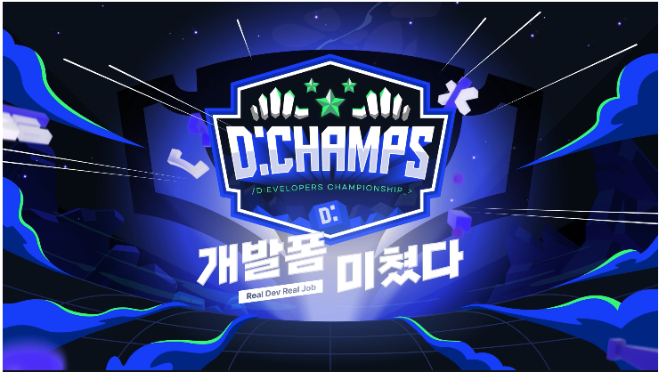
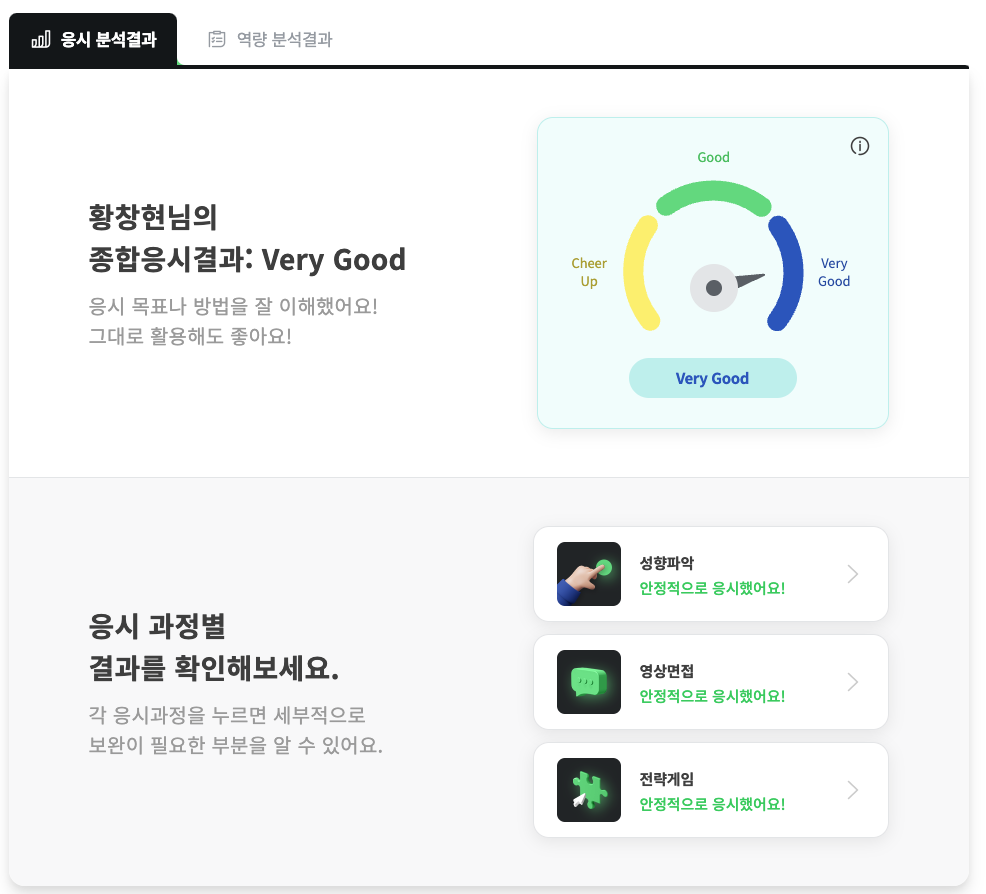
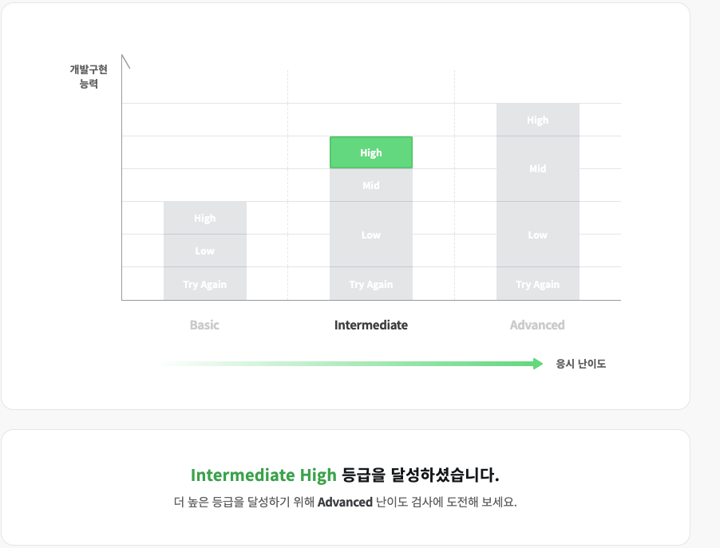

취업 공고를 이것저것 보다가 JOBDA라는 채용 플랫폼에서 스펙과 전공 무관하게 개발자 역량검사와 개발자 구현 능력 검사를 통해 회사를 매칭해 준다는 글을 보고 취업준비를 하는 저에게 어느 정도 도움이 될 것 같아서 신청 후 검사해보았습니다!

여기에서 얘기하는 것을 간단하게 설명드리면 스펙과 전공을 보지 않고 해당 플랫폼에서 제공하는 **개발자 역량검사와 개발자 구현 능력 검사** 이 2가지 만을 보고 점수가 높을수록 더 많은 기업 추천을 해주는 시스템 같았습니다.

기간은 **4/16(일) 23:30분까지**이니 관심 있으신 분들은 해보시는 것도 좋을 것 같아요!

**\[관련 사이트\]**
[JOBDA 디챔스](https://www.jobda.im/position/2251/jd "잡다 디챔스")

### **개발자 AI 역량검사**

#### **1\. 성향파악**

신속하게 본인과 가까운 성향을 선택하는 것이었습니다. 
약간 인성 검사, 성격 유형 검사 같은 건데 굉장히 빠른 시간 내에 본인에 알맞은 것을 선택해야했습니다.

#### **2\. 전략게임**

가위바위보, 대중교통 연결하기, 고양이 찾기 등 다양한 게임이 있는데 별거 아니라 생각했지만 생각보다 힘들었던 것 같아요! 모든 전략게임들이 빠른 시간 내에 해결해야 하는 문제이다 보니 시간에 엄청 쫓기게 되는데 그 시간 동안 엄청난 집중을 해야 해서 더 힘들었던 것 같습니다. 모든 게임은 시작 전 체험이 가능하니 사이트에서 직접 체험해 보고 연습한 다음 진행하는 것이 고득점을 맞는데 도움이 될 것 같아요!

#### **3\. 영상면접**

처음에 호기심으로 시작하다 보니 뭐가 있는지도 모르고 검사를 눌러서 마지막을 보니 영상면접이 있었습니다. 영상면접이라는 단어를 보고 "아 망했다. 준비한게 없는데 어떻게 하지?"라고 생각이 들더라구요. 영상면접은 프로그램에서 질문을 주면 30초 동안 시간을 주고 나머지 주어진 시간 동안 대답을 하는 면접이었습니다. 실제 면접관이 있는 것이 아니기 때문에 조금 더 편하게 할 수 있었는데 아무래도 준비하지 않고 해서 그런지 대답은 자연스럽게 했어도 내용의 질이 많이 떨어졌던 것 같습니다.

이렇게 3가지에 대해서 검사하고 약 40분 정도 소요되었습니다.
검사 결과는 길면 하루 뒤에 나온다고 하는데 저는 1~2시간 뒤에 나왔습니다!!

검사 결과는 Very Good! 조금 걱정했는데 생각보다 잘 나온 것 같아서 다행인 것 같아요 ㅎㅎ!!

### **개발 구현 능력 검사**

개발 구현 능력 검사는 일반 코딩테스트랑 비슷하나 살짝 달랐습니다. Basic, Intermediate, Advanced 3가지로 나뉘는데 처음 검사하는 경우 Basic이랑 Intermediate 2개 중에서 선택해서 검사할 수 있었습니다. 저는 처음이니 Intermediate를 시험 보았고 문제는 밝힐 수 없으나 문제가 점점 확장되는 방식이었습니다. 1시간 30분 동안 3문제를 푸는데 마지막 문제에서 시간이 부족해서 다 풀지는 못했어요. 분명 풀 수 있는 문제 같았는데 그 전 두 번째 문제에서 실수를 해서 20분을 낭비해서 너무 아쉬웠습니다. 그리고 개발 구현 능력 검사는 바로 결과가 나와요!

시험 결과는 걱정했던거와 달리 Intermediate에서 제일 높은 등급인 High 등급을 받았습니다! 지금까지 코테 문제를 꾸준히 연습하면서 실력이 좋아지고 있는 게 맞는가 싶었는데 정확한 판단법은 아니지만 조금은 나아졌다는 것을 증명할 수 있는 자료 같아서 기분이 좋았습니다. 다음 주 토요일에도 있는데 시간이 난다면 Advanced도 다시 한번 검사해 보려구요!

이 시험을 다 치르고 보니 고등학교 졸업 후 바로 대기업에 취직했을 때 인적성 검사를 보던 게 기억이 났습니다. 비슷한 느낌인데 확실히 기술이 발전하니 이렇게 AI로도 전부 다 처리할 수 있다는 게 너무너무 신기했습니다. 신입으로 개발자를 지원하시는 분들이라면 실력 테스트 차원에서 해보는 것도 정말 좋은 기회가 될 것 같습니다!