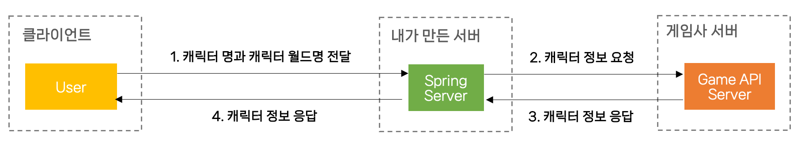
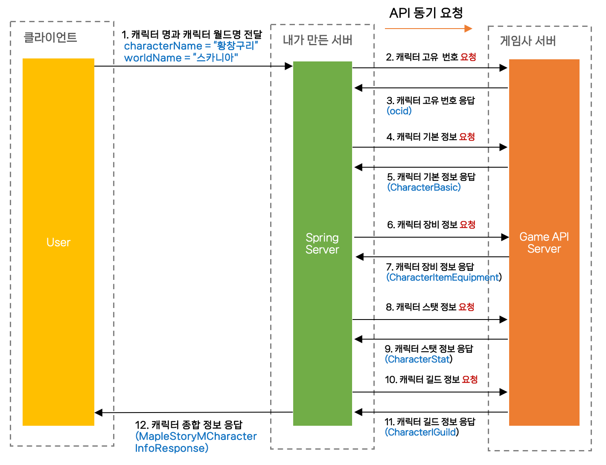

안녕하세요. 저번 글에서는 프로젝트에서 구현할 기능들과 간단한 서비스 흐름도를 그려보며 설계를 해보았습니다.

이번 글에서는 프로젝트의 핵심 주요 기능에 대한 흐름을 설계하여 그림으로 좀 더 자세하게 표현하고 설명해보고자 합니다.

우선 OMG 프로젝트의 기본 기능 흐름도는 아래와 같습니다.

### 기본 기능 흐름도



1. 클라이언트가 메이플스토리M의 캐릭터 명과 캐릭터 월드명을 웹페이지에 입력하여 Spring 서버로 전달합니다.

2. 전달 받은 Spring서버는 클라이언트의 캐릭터 명과 캐릭터 월드명을 이용하여 게임사 서버로 캐릭터 정보를 달라고 요청합니다.

3. 요청을 받은 게임사 API 서버는 캐릭터 정보를 Spring 서버로 응답합니다.

4. 게임사로부터 받은 캐릭터 응답 값을 Spring서버에서 하나로 모아 클라이언트에게 응답합니다.

위 네가지 순서는 OMG 프로젝트의 기본 기능이면서 제일 중요한 기능으로 볼 수 있습니다. 이 기능을 메이플스토리M 게임에 빗대어 자세하게 설명해보도록 하겠습니다.

### MapleStoryM 캐릭터 조회 기능 흐름도


1. 메이플스토리M 게임의 캐릭터 명과 캐릭터 월드명을 Spring Server로 전달합니다.
2. 전달 받은 캐릭터명과 캐릭터 월드명을 이용하여 캐릭터 고유 번호를 요청합니다.
3. 캐릭터 고유 번호를 응답받습니다.
    - 해당 게임의 API는 무조건 사용자 이름과 월드명을 통해 ocid라는 캐릭터 고유 번호를 받고 해당 고유 번호로 캐릭터의 정보를 요청할 수 있게 되어있습니다.
4. 캐릭터 기본 정보를 요청합니다.
5. 캐릭터 기본 정보를 응답받습니다.
6. 캐릭터 장비 정보를 요청합니다.
7. 캐릭터 장비 요청을 받습니다.
8. 캐릭터 스탯 정보를 요청합니다.
9. 캐릭터 스탯 정보를 응답받습니다.
10. 캐릭터 길드 정보를 요청합니다.
11. 캐릭터 길드 정보를 응답받습니다.
12. 게임사로부터 받은 모든 정보를 종합하여 클라이언트에게 응답합니다.


### RestTemplate 동기를 사용한 이유
우선, 3번에서 말씀드렸듯이 사용자의 캐릭터 명과 캐릭터 월드명을 이용하여 ocid를 먼저 받은 다음, ocid로 나머지 캐릭터에 대한 정보를 요청해야합니다. 그래서 2번에서 API를 요청할 때는 무조건 동기적으로 작동해야하고, 나머지 4번부터 11번 사이의 요청들은 비동기로 돌아가도 됩니다. 저는 우선 ocid를 제외한 API 요청은 4개여서 요청 개수가 적다고 생각이 들었고, 요청마다의 응답시간이 길지 않았기 때문에 동기적으로 동작시켜도 괜찮겠다고 생각이 들었습니다.


### 기본 기능 코드
이번에는 위의 기능을 코드로 옮겨보도록 하겠습니다.

1. 클라이언트가 메이플스토리M의 캐릭터 명과 캐릭터 월드명을 웹페이지에 입력하여 Spring 서버로 전달합니다.

    **GameController.java**
    ```java
    @RestController
    @RequiredArgsConstructor
    @RequestMapping("/games")
    public class GameController {

        private final GameService gameService;

        @GetMapping("/maplestorym")
        public ResponseEntity<MapleStoryMCharacterInfoResponse> getCharacterInfo(
                @RequestParam final String characterName,
                @RequestParam final String worldName
        ) {
            final MapleStoryMCharacterInfoResponse  mapleStoryMCharacterInfoResponse = gameService.  getMapleStoryMCharacterInfo(
                    characterName,
                    worldName
            );

            return ResponseEntity.ok(mapleStoryMCharacterInfoResponse);
        }
    }
    ````
    - Controller를 통해 characterName과 worldName을 받습니다.

 2. 전달 받은 Spring서버는 클라이언트의 캐릭터 명과 캐릭터 월드명을 이용하여 게임사 서버로 캐릭터 정보를 달라고 요청한 이후 클라이언트에게 응답합니다.

    **GameService.java**
 
    ```java
    @Service
    @RequiredArgsConstructor
    public class GameService {

        private final MapleStoryMApi mapleStoryMApi;

        public MapleStoryMCharacterInfoResponse getMapleStoryMCharacterInfo(
                final String characterName,
                final String worldName
        ) {
            final Character character = mapleStoryMApi.getCharacterOcid(characterName, worldName); // 캐릭터 고유 번호
            final CharacterBasic characterBasic = mapleStoryMApi.getCharacterBasic(character.ocid()); // 캐릭터 기본 정보
            final CharacterItemEquipment characterItemEquipment = mapleStoryMApi.getCharacterItem(character.ocid()); // 캐릭터 장비 정보
            final CharacterStat characterStat = mapleStoryMApi.getCharacterStat(character.ocid()); // 캐릭터 스탯 정보
            final CharacterGuild characterGuild = mapleStoryMApi.getCharacterGuild(character.ocid()); // 캐릭터 길드 정보

            return MapleStoryMCharacterInfoResponse.of(
                    characterBasic,
                    characterItemEquipment,
                    characterStat,
                    characterGuild
            );
        }
    }
    ```
    - GameService에서는 받은 characterName과 worldName을 이용해서 게임사 API 서버로 캐릭터에 대한 정보를 종류별로 요청하고 받은 값을 모두 종합하여 하나의 캐릭터 종합 정보로 클라이언트에게 응답합니다.

    **MapleStoryMApi.java**
    ```java
    public interface MapleStoryMApi {

        Character getCharacterOcid(final String characterName, final String worldName);

        CharacterBasic getCharacterBasic(final String ocid);

        CharacterItemEquipment getCharacterItem(final String ocid);

        CharacterStat getCharacterStat(final String ocid);

        CharacterGuild getCharacterGuild(final String ocid);
    }
    ```
    - MapleStoryMApi는 MapleStoryM API 서버에 캐릭터와 관련된 정보를 요청하기 위한 인터페이스입니다. 클래스로 작성해도되지만, 인터페이스로 작성한 이유는 추후 RestTemplate의 동기 방식이 성능이 좋지 않을 경우 WebClient를 이용한 비동기 처리로 유연하게 변경하기 위함입니다.

    **MapleStoryMApiRestTemplate.java**
    ```java
    @Component
    @RequiredArgsConstructor
    public class MapleStoryMApiRestTemplate implements MapleStoryMApi {

        private final RestTemplate restTemplate;
        private final MapleStoryMProperties mapleStoryMProperties;

        public Character getCharacterOcid(final String characterName, final String worldName) {
            return restTemplate.exchange(
                            createOcidApiUri(characterName, worldName),
                            HttpMethod.GET,
                            new HttpEntity<>(createHttpHeaders()),
                            Character.class)
                    .getBody();
        }

        private String createOcidApiUri(final String characterName, final   String worldName) {
            return UriComponentsBuilder.fromHttpUrl(
                            mapleStoryMProperties.getBaseUrl() +    mapleStoryMProperties.getOcidApiUri()
                    )
                    .queryParam("character_name", characterName)
                    .queryParam("world_name", worldName)
                    .build()
                    .toUriString();
        }

        ... 여러 API 요청 메서드
    }
    ```
    - API 요청 구현 코드이며, 메이플스토리M에 대한 모든 API 요청을 위한 클래스입니다.

자, 지금까지 OMG 프로젝트의 기본 기능에 대한 설계와 코드에 대해서 살펴보았습니다. 현재는 MapleStoryM에 대한 코드만 있지만, 추후 확장하면서 다른 게임들도 모두 이런식으로 게임사 API 서버를 통해 데이터를 받아 응답할 예정입니다.


