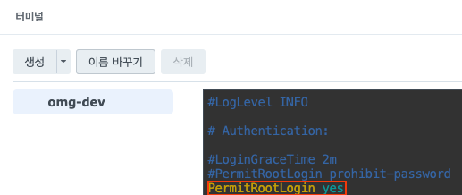

일전에 기획 단계의 글에서 QA를 위해 dev 환경과 prod 환경을 구분짓기로 결정했었다고 했습니다. 아직 운영 단계까지 가려면 시간이 걸리기 때문에 prod 환경은 나중에 만들기로하고 우선 테스트를 위한 dev 환경을 구축해보도록 하겠습니다.

## Synology NAS의 Docker로 Ubuntu 구축하기
아무래도 dev환경은 테스트 환경이고, 개인 프로젝트이다보니 클라우드 서비스를 이용하기는 금액적으로 부담이 생깁니다. 그래서 저는 집에 연결되어있는 Synology NAS의 Docker 기능을 이용하여 Ubuntu를 구축해보려 합니다. 

Synology NAS는 네트워크에 연결된 개인 스토리지 서버이지만, Synology사에서 만든 NAS는 다른 서버의 역할도 할 수 있도록 여러가지 기능들을 제공합니다. 그 중 하나가 Docker인데 Container Manager라는 앱을 통해 여러가지 서버를 구축할 수 있습니다.

### 1. 레지스트리 다운로드

- 우선 NAS의 Container Manager 앱을 설치하고(지원되는 기종이 따로 있음) 접속하여 레지스트리를 클릭합니다.
- 원하는 이미지의 이름을 적고 다운로드 받습니다.

### 2. 이미지 실행 시키기

- 받아온 이미지를 클릭하여 실행시킵니다.

### 3. 컨테이너 설정

- 컨테이너 이름을 설정합니다.


- 고급 설정에서 포트를 설정해줍니다.
- dev 환경은 Docker Hub를 이용하지 않고 github actions 서버에서 NAS로 scp를 이용하여 빌드된 파일을 보내줄 예정이기 때문에 scp와 ssh를 위한 포트를 설정합니다.
- 이때 왼쪽에 있는 포트는 NAS 서버로 접근할 때의 포트를 의미하고, 오른쪽 포트는 컨테이너 환경안에서의 포트입니다.
- 나머지 설정은 건드리지 않고 컨테이너 설정을 완료시킵니다.

### 4. 컨테이너 실행 및 SSH 설정

- 우선 컨테이너 설정이 끝나면 컨테이너 탭에 들어가 터미널 열기를 해야합니다.
- Docker로 만들어진 Ubuntu의 경우 설치되어있는게 없는 깡통이기 때문에 SSH 접속을 위한 설치를 해주어야합니다.


- apt update 명령어를 통해 운영체제에서 사용 가능한 패키지들과 그 버전에 대한 정보를 업데이트합니다.


- apt install openssh-server 명령어를 통해 ssh를 다운받습니다.


- apt install vim 명령어를 통해 ssh 설정을 위한 vim을 설치합니다.


- vim /etc/ssh/sshd_config 명령어를 통해 해당 파일로 들어가 위 사진과 같이 작성하여 루트 로그인으로 접근 가능하게 설정합니다.
- 사진엔 없지만 아래로 내리다보면 PasswordAuthentication 항목이 있는데 주석을 풀어 yes로 설정해두어야 아이디와 패스워드로 로그인이 가능합니다.


- 마지막으로 루트에 대한 패스워드를 설정하여 해당 패스워드로 로그인할 수 있게 합니다.

모든 작업이 끝나면 service ssh restart로 ssh 서버를 재실행합니다.

### 5. build된 파일을 실행시키기 위한 java 설치

- ssh 설치가 종료되면 jar 파일로 빌드된 파일을 실행시킬 수 있도록 java를 설치해줍니다.

### 6. 공유기 포트포워딩 설정하기

- 집에 있는 NAS 서버이기 때문에 공유기를 거쳐서 집안에 있는 NAS 서버로 접근하게 됩니다.
- NAS에서의 SSH 접근 포트를 2233으로 설정했었기 때문에 공유기에서는 NAS의 2233 포트를 바라보아야하고 외부에서는 공유기에서 설정한 외부포트에 의해 접근할 수 있게 됩니다.


- 그래서 저는 공유기 외부포트도 내부포트와 동일하게 2233으로 설정하고 NAS 서버 IP에 대한 포트포워딩을 진행했습니다.

### 7. 외부에서 NAS 서버 접속해보기

```shell
ssh root@서버주소 -p 포트번호
```
- 위와 같이 노트북에서 ssh를 이용하여 접속하는 경우 정상적으로 접속되는 것을 확인해볼 수 있습니다.

## Github Actions를 이용하여 빌드 배포 자동화하기
```yaml
name: cd-dev

on:
  push:
    branches: [ "dev" ]

jobs:
  deploy-to-ec2:
    environment: dev
    runs-on: ubuntu-latest

    steps:
      - name: Github Repository Checkout # 코드 불러오기
        uses: actions/checkout@v3

      - name: Set up JDK 17 # 자바 버전 세팅
        uses: actions/setup-java@v3
        with:
          java-version: '17'
          distribution: 'temurin'

      - name: Build with Gradle # 빌드
        uses: gradle/gradle-build-action@v2
        with:
          arguments: build

      - name: Sending build file to NAS # scp를 이용하여 nas 서버로 jar 파일 전송
        uses: appleboy/scp-action@master
        with:
          host: ${{ secrets.NAS_HOST }}
          port: ${{ secrets.NAS_PORT }}
          username: ${{ secrets.NAS_USERNAME }}
          password: ${{ secrets.NAS_PASSWORD }}
          source: "build/libs/*.jar"
          target: "/root/omg/"

      - name: SSH to NAS # ssh 접속 후 스크립트 실행
        uses: appleboy/ssh-action@master
        with:
          host: ${{ secrets.NAS_HOST }}
          port: ${{ secrets.NAS_PORT }}
          username: ${{ secrets.NAS_USERNAME }}
          password: ${{ secrets.NAS_PASSWORD }}
          script: |
            cd /root/omg
            nohup ./process.sh &
            
```

### 추가 주의 사항
- NAS 서버에 포트 설정시 ssh 접속을 위한 포트만을 설정했었는데, **추가로 spring서버에서 사용하는 포트를 별도로 컨테이너 설정과 공유기에서** 설정해주어야 합니다.

- 도커로 올린 Ubuntu의 경우, 재시작시 ssh 서비스가 돌고 있지 않습니다. 일반 리눅스의 경우 systemctl을 활용하여 시작시 서비스를 실행하는 스크립트를 작성할 수 있지만, **도커로 올린 리눅스의 경우 systemctl을 활용하지 못하여 재시작시 직접 ssh 서비스를 켜주어야합니다!**

- yml 파일에 설정된 환경 변수의 경우, Docker였다면 환경변수를 github actions를 통해 전송받아 주입받을 수 있지만 **일반 EC2의 경우 별도의 환경 변수 주입이 어렵기 때문에 서버에 직접 설정**해두어야합니다.

- 빌드 배포시 이미 실행되고 있는 자바 프로세스를 중지시키고 다시 시작시켜야하기 때문에 아래와 같은 스크립트를 짜서 해야합니다.

  ```shell
  #!/bin/bash

  # 'java' 프로세스의 PID를 찾습니다.
  pid=$(ps -ef | grep 'java' | grep -v grep | awk '{print $2}')

  # PID가 비어있지 않은 경우, 해당 프로세스를 종료합니다.
  if [ -n "$pid" ]; then
    kill -9 $pid

    echo "Java process $pid has been terminated."
    echo "And start spring server."
  else
    echo "No Java process found."
  fi

  nohup java -jar /root/omg/build/libs/*.jar &
  ```

위와 같이 dev branch에 코드가 병합되면 github actions을 통해 코드를 빌드하고, 빌드된 jar파일을 scp를 이용해 NAS 서버로 전달하여 실행하는 것 까지 해보았습니다. 현재는 자동화 되지 못한 부분들이 있는데, 빠른 개발을 위하여 추후 개선 과제로 남겨두도록 하겠습니다.