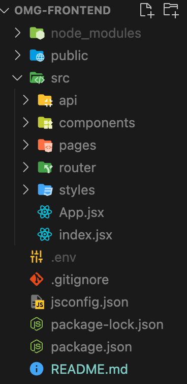
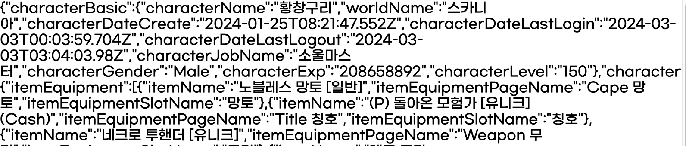
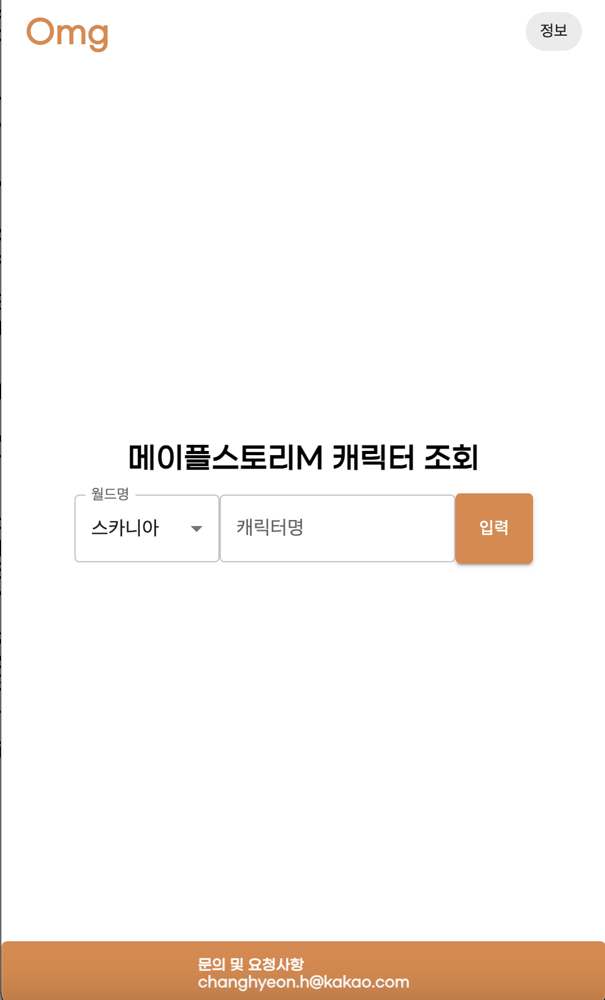
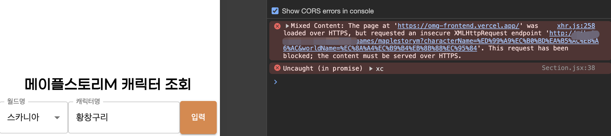
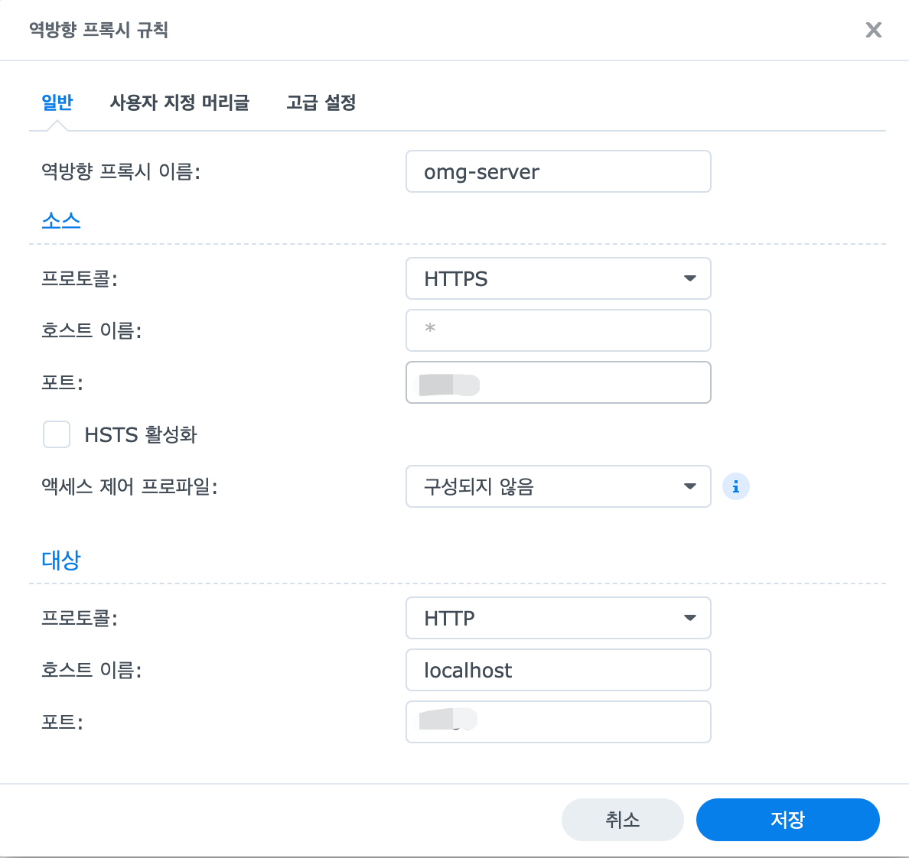

우선 MVP를 먼저 만들어서 1차 배포를 하려고 합니다. 백엔드의 최소 기능은 벌써 구현이 되었고, 이제 프론트엔드를 구현해보려고 합니다.

## 기술 선택
사실 처음에는 타임리프를 이용해서 처리하려고 하였으나, 아무래도 Single Page Application 느낌을 내려면 돔 요소를 직접 추가하고 삭제하면서 많은 코드 작성과 생산성에 있어서 좋지 못하다고 판단하여 React를 사용하기로 결정했습니다. 또 예전에 React로 페이지를 구현해본 경험이 있어서 금방(?) 잘 할 수 있을 것 같았어요! 하지만 구현과정에서 너무 헤매다보니 이 생각을 후회하게 되었습니다...

## 프로젝트 구조 잡기


백엔드도 그렇듯, 프론트엔드도 가장 먼저 프로젝트 구조를 어떻게 잡는지에 따라서 앞으로의 생산성이 빨리 올라갈 것이라고 생각이 들었습니다. 

```markdown
  - public: static 파일
  - api: 외부 서버에 요청하기 위한 API 모듈
  - components: 자주 사용되는 컴포넌트, 예) Footer, Header
  - pages: 클라이언트가 보는 페이지
  - router: 경로에 대한 길을 찾기 위한 라우터
  - styles: 전역적으로 적용할만한 CSS 설정
```

처음부터 너무 꼼꼼하게 잡지 않고, 정말 필요한 폴더만 가져가려고 했습니다. pages에는 별도의 하위 컴포넌트 폴더를 만들어서, 해당 페이지에서만 사용되는 컴포넌트들을 집어넣었습니다. 너무 오랜만에 리액트를 하다보니 어떤 구조로 가야할지 모르겠어서, 부트캠프를 진행했을 때 프론트엔드팀이 했던 디렉터리 구조를 보고 최대한 따라하려고 했습니다.

## axiosInstance 생성 및 요청 모듈 만들기
페이지를 만들기 전, 백엔드 서버에 데이터를 요청하면 정상적으로 받아오는지 확인해보고 싶었습니다. 그래서 저는 axios를 이용해서 백엔드 서버에 데이터를 요청하는 것으로 결정했습니다.

```javascript
import axios from 'axios';

const axiosInstance = axios.create({
    baseURL: process.env.REACT_APP_BASE_URL,
    headers: {
        'Content-Type' : 'application/json',
    },
    timeout: 5000
});

export default axiosInstance;
```

클라이언트가 백엔드 서버로 요청할 때 항상 공통으로 들어가는 것을 미리 설정해준다면 반복된 코드를 줄일 수 있습니다. 그러한 역할을 하는 것을 이제 axios.create()로 만들어서 인스턴스를 만들어둘 수 있습니다.


```javascript
import axiosInstance from "src/api/axiosInstance";

export const getMapleStoryMCharacterInfo = async (characterName, worldName) => {
    const { data } = await axiosInstance.get("/games/maplestorym", {params: {characterName, worldName}});

    return data;    
}
```
생성한 axiosInstance로 백엔드에 요청하는 코드입니다. 이 파일은 api 폴더안에 있는 코드고, 이렇게 분리했을 때 장점은 화면을 표시하는 곳에 api 요청 로직을 최대한 숨겨 가독성을 증가시킬 수 있습니다.

## CORS 문제 해결
현재 저의 경우 클라이언트 서버를 `http://localhost:3000` 으로 띄우고 있고, 백엔드 데이터를 불러오기 위한 백엔드 서버는 NAS서버의 주소로 띄워져있습니다. 그러다보니 클라이언트의 origin과 백엔드의 origin이 다르게 되는데, 이럴 경우 출처가 달라 CORS 교차 출처 리소스 공유 문제가 생기게 됩니다. 교차 출처가 가능할 경우 CSRF나 XSS와 같은 문제가 발생하기 때문에 브라우저에서는 이러한 문제를 막고있는 것이죠. 자세한 설명은 [CORS MDN 설명](https://developer.mozilla.org/en-US/docs/Web/HTTP/CORS)참고 하셔도 좋을 것 같습니다.

저는 이러한 문제를 해결하기 위해 백엔드 서버에서 해당 출처를 허용해주기로 했습니다.
```java
@Configuration
@RequiredArgsConstructor
public class WebConfig implements WebMvcConfigurer {

    private final CorsProperties corsProperties;

    @Override
    public void addCorsMappings(final CorsRegistry registry) {
        registry.addMapping("/**")
                .allowedOrigins(corsProperties.getLocal());
    }
}
```

spring에서는 이런식으로 설정이 가능합니다. 모든 주소에 대해 localhost 오리진을 허용한다는 설정이며, 추후 배포된 서버에 대해서도 추가 적용할 예정입니다.


모든 설정이 끝나고 페이지에서 출력해보았는데 정상적으로 요청을하고 응답받는 것을 확인해볼 수 있었습니다.

## MainPage 구현
우선 메인 페이지를 구현하기 위해 어떤 배치를 할 것인지 먼저 생각해야했습니다.

- Header
- Section
- Footer

제가 하는 프로젝트의 경우 메인페이지는 정말 단순하게 사용자에게 캐릭터명과 캐릭터 월드명을 입력받는 것이기 때문에 복잡할 필요가 없다고 생각했습니다. 하여 Header와 Section, Footer로 나누고 Section에만 Input값을 받을 수 있도록 했습니다. 아래는 Section 컴포넌트 코드입니다.

```javascript
export const Section = () => {
    const worldNames = ['스카니아','루나','제니스','크로아','유니온','엘리시움','아케인'];
    const worldNameComponents = worldNames.map((value, index) => (<MenuItem key={index} value={value}>{value}</MenuItem>))

    const navigate = useNavigate();

    const [characterName, setCharacterName] = useState('');
    const [characterWorldName, setCharacterWorldName] = useState('');

    const handleChange = (event) => {
        setCharacterWorldName(event.target.value);
    };
  

    const getData = async () => {
        if(characterName === '' || characterWorldName === ''){
            alert("캐릭터명 또는 월드명을 입력해주세요")
            return;
        }

        const data = await getMapleStoryMCharacterInfo(characterName, characterWorldName);
        navigate('/result', {
            state: data
        });
    }
    

    return (
        <SectionContainer>
            <SectionHeader>
                메이플스토리M 캐릭터 조회
            </SectionHeader>
            <SearchConatiner>
                <Box sx={{ minWidth: 120 }}>
                    <FormControl fullWidth>
                        <InputLabel id="demo-simple-select-label">월드명</InputLabel>
                        <Select
                            labelId="demo-simple-select-label"
                            id="demo-simple-select"
                            value={characterWorldName}
                            label="월드명"
                            onChange={handleChange}
                        >
                            {
                                worldNameComponents
                            }
                        </Select>
                    </FormControl>
                </Box>
                <TextField id="outlined-basic" label="캐릭터명" variant="outlined" onChange={(e) => setCharacterName(e.target.value)}  />
                <SizeButton variant="contained" onClick={getData}>입력</SizeButton>
            </SearchConatiner>
        </SectionContainer>
    )
}

const SizeButton = styled(Button)({
  backgroundColor:'#c86c1ccc',
  height:'58px',
})
```

직접 CSS를 해서 버튼과 Input을 만들면 좋겠지만, 빠른 구현을 위해 MUI를 이용했습니다. 만약 버튼을 누를 경우, 입력된 캐릭터 명과, 월드명을 아까 만든 axios 모듈에 넣어 요청하고 응답받도록 처리했습니다. 또한 여기서 응답을 받으면 `/result` 페이지로 이동하여 데이터를 보여주는 방식으로 하고싶었습니다. 하여 useNavigate()를 이용하여 `/result` 페이지로 이동하게 했고, 이동할 때 axios를 통해 받은 데이터도 같이 넘겨주도록 했습니다.



## Router 적용
응답 값을 다른 페이지로 넘기기 위해 Router를 적용하여 다른 페이지로 이동할 수 있도록 해야합니다. Router는 사용자가 입력한 주소를 감지하여 해당하는 주소의 페이지로 이동시킬 수 있게 도와주는 역할을 합니다.

```javascript
export const router = createBrowserRouter([
    {
      path: "/",
      element: <MainPage />,
    },
    {
      path: "result",
      element: <ResultPage />,
    },
]);
```
이렇게 router를 만들고 최상위 App에 RouterProvider를 생성하여 넣어주면 됩니다.

## Vercel 배포
Result 페이지를 제외하고, 우선 테스트 배포부터 해보았습니다. 테스트 배포여서 그래도 주변에서 가장 많이 사용한다고 들었던 Vercel를 이용하여 배포했습니다.

[배포 링크](https://omg-frontend.vercel.app/)

배포하는 방법은 정말 단순해서 별도로 올리지 않았습니다.


배포 후 데이터를 정상적으로 받아오는지 테스트해보려고 입력을 눌러보았는데 오른쪽과 같이 Mixed Content라는 에러가 떴습니다. 확인해보니 클라이언트 서버는 https이고 백엔드 개발 서버는 http로 이루어져있었기 때문에 혼합 콘텐츠 차단이 발생하는 것이었습니다. 아무래도 https로 통신을 하게 되면 해당 통신이 암호화되지만, https와 http 통신을 하게되면 https 통신이 불가하기 때문에 보안적으로 취약합니다. 이것을 방지할 수 있는 방법은 여러가지가 있지만 저는 서버에 SSL 인증서를 올려 처리해보기로 했습니다.



제가 사용하는 NAS에는 역방향 프록시를 지원하는데 클라이언트에서 백엔드 서버로 요청을 할 때 HTTPS로 요청하는 경우 NAS에서 HTTPS 요청을 받아 로컬에서 돌리는 웹서버의 포트로 HTTP로 전달할 수 있게 해줍니다. 이렇게 하면 클라이언트에서 백엔드 개발 서버로 바로 요청가는 것이 아닌 클라이언트에서 NAS 서버의 역방향 프록시를 타고 백엔드 개발 서버로 가는 것이기 때문에 해결할 수 있습니다.


