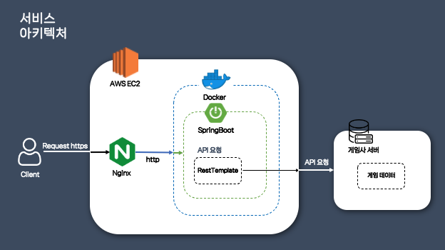
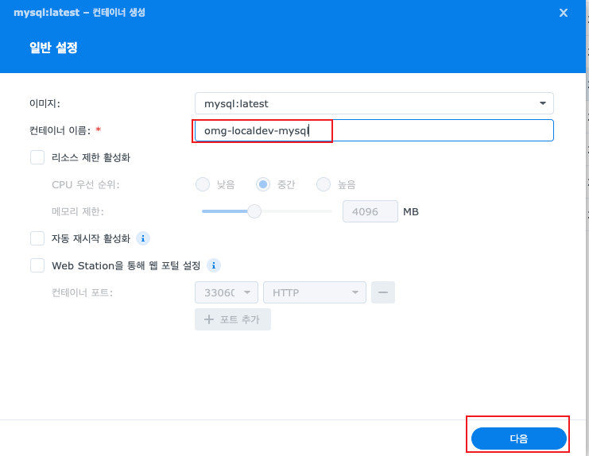

저번 글까지는 클라이언트가 게임을 선택하고 그 게임에 맞는 Input 값을 입력하면 캐릭터가 조회되며 캐릭터에 대한 상세 정보를 보여주는 기능을 만들었었습니다. 이번에는 사용자들에게 조금 더 재미 요소를 추가하고자 하루동안 검색된 캐릭터들의 횟수를 구하여 메인페이지 조회시 랭킹을 보여주려고 합니다.

### 랭킹 기능 아키텍처 

현재까지 구현된 캐릭터 조회 기능만 생각해보면, 데이터베이스 없이 게임사 서버로 부터 받은 데이터를 정리하여 클라이언트에게 보내주기만 하면 됩니다. 하지만 새로 추가될 캐릭터들의 조회 횟수 랭킹을 구현하려면 사용자들이 조회한 캐릭터에 대한 정보를 데이터베이스에 기록해두어야합니다.

#### 변경 전 아키텍처


#### 변경 후 아키텍처


그러기 위해 RDS를 추가하고, 캐릭터에 대한 조회 정보를 데이터베이스에 기록하기로 결정했습니다. 

### dev 환경 MySQL 구축하기
현재는 운영 환경 서버가 구축된 것이 아니기 때문에 개인 NAS 서버에 있는 Docker를 활용하여 MySQL 서버를 구축했습니다. 

#### 레지스트리에서 MySQL 선택

NAS의 Container Manager에 들어가서 레지스트리 탭을 선택 후 MySQL을 선택하여 클릭합니다.

#### 이미지 실행
 <br>
이미지 탭에 들어가서 MySQL을 실행시킵니다.

#### 이미지 설정
 <br>
MySQL 버전과 컨테이너 이름을 설정해줍니다. <br>

 <br>
다음을 클릭하여 포트를 지정해줍니다. 이때 왼쪽은 컨테이너 밖의 외부 포트이고, 오른쪽은 컨테이너안에서 쓰이는 내부포트입니다. MySQL의 포트는 기본적으로 3306 이기 때문에 별도로 설정하지 않는 경우 오른쪽 내부 포트는 그대로 두면되고, 외부에서 접속하는 포트를 변경하고 싶을 땐 왼쪽은 다르게 포트를 주면 됩니다. <br>

 <br>
마지막으로 컨테이너 안에서 실행될 환경변수를 설정해주어야합니다. 위 사진처럼 총 4개의 환경변수를 세팅하여, 실행시 해당하는 정보로 설정되어 실행될 수 있도록 합니다.

#### 컨테이너 실행
마지막으로 컨테이너 실행을 시키면, 정상적으로 컨테이너가 올라오게되고 외부에서 접속하기 위해 공유기에서도 포트포워딩을 해주어야합니다. 저의 경우 이미 해당 NAS 서버가 DMZ 설정이 되어있어서 건너뛰도록 하겠습니다.

### 랭킹 기능 테이블 설계
우선 랭킹을 위해 저장해야하는 정보는 `게임명`,`월드명`,`캐릭터명`,`생성시각`,`수정시각` 총 5가지입니다. 카운트 컬럼을 따로 두어 해당 캐릭터가 몇번이나 조회되었는지 체크해서 랭킹을 산정할까도 고려했지만, 일일 단위로 조회 개수를 판단해야했기 때문에 해당 방식으로는 구현할 수 없었습니다.

```sql
create table game_character_search_log (
    id bigint not null auto_increment,
    game_type varchar(20) not null,
	world_name varchar(50),
    character_name varchar(50) not null,
	created_at datetime(6),
    updated_at datetime(6),
    primary key (id)
) engine=InnoDB
```

### 랭킹 기능 쿼리 작성

