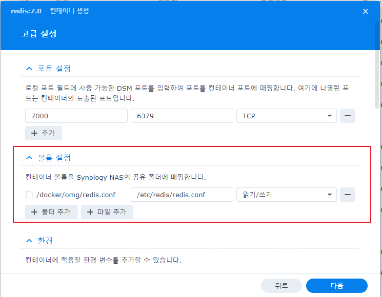

## 1. 랭킹 서비스에 대한 이해

## 1.1 랭킹 서비스 개선 전 플로우


저번에는 일일 캐릭터 조회 랭킹 서비스를 위 그림과 같이 구성하여 진행했습니다. 아래에 다시 정리해보자면

1. 클라이언트가 랭킹 데이터를 요청합니다.
2. SpringBoot 서버에서 JPQL을 이용하여 랭킹 쿼리를 날립니다.
3. 쿼리를 통해 조회된 데이터들이 클라이언트에게 전달됩니다.


### 랭킹 서비스를 개선해야하는 이유

해당 랭킹 서비스는 누군가를 조회하기전에 화면에서 필히 보여지며 사용자가 많아지는 경우 동일하게 해당 랭킹 서비스의 요청도 많아지게 됩니다. 결국 랭킹 서비스의 요청이 많아진다는 것은 그만큼 위에 적힌 긴 쿼리들의 요청도 많아지게되고 결국 성능에 저하가 생기게 됩니다. 주된 성능 저하로 COUNT 연산을 해야하고, 조회된 사용자들이 많아지면 많아질수록 테이블의 데이터가 많아지게되는데 위 쿼리는 풀테이블 스캔을 하기 때문에 주된 성능 저하로 볼 수 있겠습니다.

저는 이것을 **Redis의 SortedSet**을 활용한다면 데이터베이스의 부하를 줄일 수 있다고 생각했습니다.


## 1.2 랭킹 서비스 개선 후 플로우


이 구성은 개선 후의 랭킹 조회 서비스이며 플로우는 아래와 같습니다.

1. 클라이언트가 캐릭터를 조회를 합니다.
2. 외부 API로 받아온 유저 정보를 Redis에 **SortedSet** 형태로 저장합니다. 
    - 이때 **Key는 게임의 이름**이 되고 안에 들어가는 **Value는 조회된 유저의 정보 객체인 CharacterInfo** 그리고 마지막 **Score는 유저의 조회 횟수** 입니다.
    - SortedSet 자료구조는 Redis에서 지원하는 정렬된 집합이라고 볼 수 있습니다.
3. 클라이언트가 랭킹을 조회합니다.
4. SpringBoot 서버에서 SortedSet 형태로 저장된 Redis의 데이터를 1위부터 5위까지 가져옵니다.
5. 클라이언트에게 해당 데이터를 전달합니다.
6. 일일 랭킹이기 때문에 자정이 되면 Spring Scheduler에 의해서 Redis에 있는 랭킹 데이터가 삭제됩니다.

### 랭킹 서비스 개선 후 얻을 수 있는 장점
우선 랭킹을 조회하기 위해 DB에 쿼리를 날리지 않아도 되는 것이 가장 큰 장점입니다. Redis에 저장할 때마다 SortedSet을 이용하여 Value의 Score을 기반으로 자동 정렬이 되고, 이것을 랭킹처럼 사용할 수 있습니다. 물론 Redis라는 관리포인트가 하나 더 생기는 것이지만 DB의 조회를 없애고 조회에 있어서 성능적으로 간편하게 조회가 가능합니다.


## 2. 랭킹 서비스 구현하기

## 2.1 Synology NAS로 Redis서버 구축하기

1. Container Manager에서 Redis 검색 후 클릭
    

2. Redis 이미지 클릭
    

3. Redis 설정

    
    
    - 포트는 첫번째가 외부이고, 두번째는 컨테이너 내부입니다.
    - 컨테이너 내부에서는 6379 기본 포트로 동작하고 외부에서 접근할 때는 7000으로 변경하겠습니다.

    
    - 그리고 Redis에 대한 설정 파일을 미리 만들어서 넣어주도록 하겠습니다.
    - 기본적으로 Redis는 패스워드가 없기 때문에 패스워드를 설정해줍니다.
    - 그 외 설정은 Redis의 파일 백업 방식을 설정하거나 꽉 찼을 때 메모리 용량을 제거할 수 있는 방법에 대한 설정입니다.
      - 저는 조회가 많아지면 메모리의 양이 늘어날 수 있다고 생각하여 maxmemory에 대한 policy를 설정하여 제한 메모리까지 찼을 때 비워줄 수 있도록 했습니다.
      - 또한 스냅샷 방식을 통해 파일로 저장하고 껐다켜지더라도 복구가될 수 있도록 설정했습니다.

    
    - NAS 서버의 공유 폴더에 해당 config 파일을 넣어주고

    
    - 해당 공유 폴더와 컨테이너의 볼륨을 연결하여 사용할 수 있도록 합니다.

    
    - 컨테이너를 실행할 때 해당하는 config 파일을 토대로 실행할 수 있도록 합니다.
    - 이때 실행 명령은 설정 후 변경할 수 없으므로 꼭 해주고 가야합니다.

4. 설정된 Redis 컨테이너 실행

    
    - 만들어진 컨테이너를 실행시킵니다.


5. 컨테이너 접속하여 외부 접근을 위한 설정 진행
    
    - 터미널을 열어서 아래 명령어들을 입력합니다.
      ```shell
      apt-get update
      apt-get upgrade
      apt-get install openssh-server -y # ssh server 설치
      apt-get install vim -y # vi 편집기 설치
      passwd # ssh로 접근하기 위한 루트 사용자에 대한 비밀번호 설정
      vi /etc/ssh/sshd_config # 루트 접근 허용을 위한 설정
      ```

    
    - PermitRootLogin의 주석을 해제하고 yes로 변경

    ```shell
    vi ~/.bashrc # 서버 실행시 시작 명령어 모음
    source ~/.bashrc # 바로 적용
    ```
    
     - 컨테이너 시작시 SSH 실행되게 하기 위하여 bashrc에 설정 후 적용

    ```shell
    service ssh restart # ssh 서비스 재실행
    ```

    
    - 외부에서 해당 컨테이너로 접속이 가능하도록 포트 설정
    - 실제로 외부에서 접속하기 위해서는 공유기 포트포워딩도 필요함

    
    
    - MobaXterm 프로그램을 이용하여 접속시 정상 접근 확인

## 2.2 SpringBoot에서 기능 구현하기

1. 프로젝트에 Redis Dependency 추가

    
    

2. 접근을 위한 Property 설정

    ```yaml
    spring:
      data:
        redis:
          host: ${DEV_REDIS_HOST}
          password: ${DEV_REDIS_PASSWORD}
          port: ${DEV_REDIS_PORT}
    ```

3. Property를 읽어오기 위한 설정 진행
    ```java
    @Getter
    @RequiredArgsConstructor
    @ConfigurationProperties(prefix = "spring.data.redis")
    public class RedisProperties {

        private final String host;
        private final String port;
        private final String password;
    }
    ```
    ```java
    @Configuration
    @EnableConfigurationProperties(value = {
            CorsProperties.class,
            MapleStoryMProperties.class,
            KartRiderProperties.class,
            NexonCommonProperties.class,
            RedisProperties.class
    })
    public class PropertyConfig {

    }
    ```

4. SpringBoot와 Redis연결 및 데이터 저장 방식 등의 Redis 구성 설정
    ```java
    @Configuration
    @RequiredArgsConstructor
    public class RedisConfig {

        private final RedisProperties redisProperties;

        @Bean
        public RedisConnectionFactory redisConnectionFactory() {
            RedisStandaloneConfiguration redisStandaloneConfiguration = new RedisStandaloneConfiguration();
            redisStandaloneConfiguration.setHostName(redisProperties.getHost());
            redisStandaloneConfiguration.setPort(Integer.parseInt(redisProperties.getPort()));

            if (!redisProperties.getPassword().isEmpty()) {
                redisStandaloneConfiguration.setPassword(redisProperties.getPassword());
            }

            return new LettuceConnectionFactory(redisStandaloneConfiguration);
        }

        @Bean
        public RedisTemplate<String, Object> redisTemplate() {
            final RedisTemplate<String, Object> redisTemplate = new RedisTemplate<>();
            redisTemplate.setConnectionFactory(redisConnectionFactory());
            redisTemplate.setKeySerializer(new StringRedisSerializer());
            redisTemplate.setValueSerializer(new GenericJackson2JsonRedisSerializer());

            return redisTemplate;
        }
    }
    ```
    - AWS의 ElastiCache를 이용하게 될 경우 별도의 패스워드 설정 없이 AWS와 연결될 수 있기 때문에 PASSWORD 유무 환경에 따라 유연하게 처리하기 위해 위와 같이 설정했습니다.
    - 현재 사용되는 Key의 경우 String 형태로만 사용하고 있고, Value는 JSON 형태로 직렬화해서 처리하기 위하여 GenericJackson2JsonRedisSerializer를 사용했습니다.

5. GameRankingRedisRepository 구현

    ```java
    @Slf4j
    @Repository
    @RequiredArgsConstructor
    public class GameRankingRedisRepository {

        private static final int INCREMENT_NUMBER = 1;
        private static final int RANK_RANGE_MIN = 0;
        private static final int RANK_RANGE_MAX = 4;

        private final RedisTemplate<String, Object> redisTemplate;
        private ZSetOperations<String, Object> zSetOperations;

        @PostConstruct
        public void initialize() {
            zSetOperations = redisTemplate.opsForZSet();
        }

        public void createOrIncrementScore(final GameType gameType, final CharacterInfo characterInfo) {
            zSetOperations.incrementScore(gameType.toString(), characterInfo, INCREMENT_NUMBER);
        }

        public List<CharacterRankingResponse> findGameCharacterSearchRank(final GameType gameType) {
            final Set<TypedTuple<Object>> characterRanking = zSetOperations.reverseRangeWithScores(
                    gameType.toString(), RANK_RANGE_MIN, RANK_RANGE_MAX);

            return characterRanking.stream()
                    .map(character -> {
                        final CharacterInfo characterInfo = (CharacterInfo)character.getValue();

                        return new CharacterRankingResponse(
                                characterInfo.worldName(),
                                characterInfo.characterName(),
                                character.getScore().longValue()
                        );
                    })
                    .toList();
        }

        public void removeRanking(final GameType gameType) {
            final boolean isDeleted = redisTemplate.delete(gameType.toString());

            log.info("GameType: {} -> removed: {}", gameType.getName(), isDeleted);
        }
    }
    ```
    - 해당 Class는 Redis에 Ranking 데이터를 저장하고 랭킹을 조회, 삭제하기 위한 Repository입니다.
    - createOrIncrementScore 메서드가 동작하면, 사용자가 조회한 캐릭터의 정보가 Redis에 저장되어있는 경우 Score에 +1을 하고 없는 경우 값을 세팅하면서 1로 세팅합니다.
    - findGameCharacterSearchRank 메서드는 높은 점수로 부터 상위 5개의 데이터만 가져옵니다.
    - removeRanking 메서드는 redis에 있는 Key 값을 삭제하는 메서드이며 00시가 되면 Ranking 관련된 데이터를 삭제하기 위한 로직입니다.


6. Spring Scheduler를 이용한 랭킹 삭제 기능 구현
    ```java
    @Slf4j
    @Service
    @RequiredArgsConstructor
    public class RankSchedulerService {

        private final GameRankingRedisRepository gameRankingRedisRepository;

        @Scheduled(cron = "0 0 0 * * *")
        public void removeRanking() {
            log.info("RankingRemoveScheduler start");

            for (GameType gameType : GameType.values()) {
                gameRankingRedisRepository.removeRanking(gameType);
            }

            log.info("RankingRemoveScheduler end");
        }
    }

    ```
    - 제공하는 랭킹 서비스는 일일 랭킹이므로 Spring Scheduler를 이용하여 00시에 모든 게임에 대한 랭킹 데이터를 삭제하는 클래스를 만들었습니다.


랭킹을 위한 Redis 서버를 구축하고, Spring과 Redis를 연결하여 랭킹 기능을 구현해보았습니다. 구현된 기능들이 정상적으로 동작하는지 확인해보겠습니다.

## 3. 랭킹 서비스 개선 후

  ## 3.1 Redis 서버에서 데이터 확인
    
  
  - POSTMAN을 이용하여 2개의 서로 다른 캐릭터를 조회해봤는데 Redis에 정상적으로 데이터가 들어간 것을 볼 수 있습니다.

  ## 3.2 클라이언트 페이지에서 랭킹 확인 
  
  - 클라이언트 페이지에서 확인해보았을 때도 정상적으로 랭킹이 나오는 것을 확인해볼 수 있었습니다.

위와 같이 정상적으로 작동되는 것을 확인해볼 수 있었습니다. 해당 글에는 담지 않았지만 스케줄링도 정상적으로 동작하여 자정이 되면 초기화가 되는 것을 확인할 수 있었습니다. 이렇게 기존에 DB에 부하가 갈 수 있었던 문제를 Redis의 SortedSet을 활용하여 개선할 수 있었습니다. 이외에도 비즈니스 로직을 변경하여 쿼리문으로 조회하는 방식을 그대로 채택하고 실시간이 아닌 하루 단위로 랭킹을 산정하게된다면, 스케줄링을 이용하여 자정에 쿼리문으로 랭킹 데이터를 Redis에 넣고 Redis가 죽더라도 쿼리로 랭킹 데이터를 불러올 수 있는 방법도 구현해볼 수 있을 것 같습니다.

**개발은 항상 일정한 답이 있다기보다 비즈니스 로직에 맞게 필요한 것들을 구현하는 것이 중요한 것 같습니다.**

긴글 봐주셔서 감사합니다!