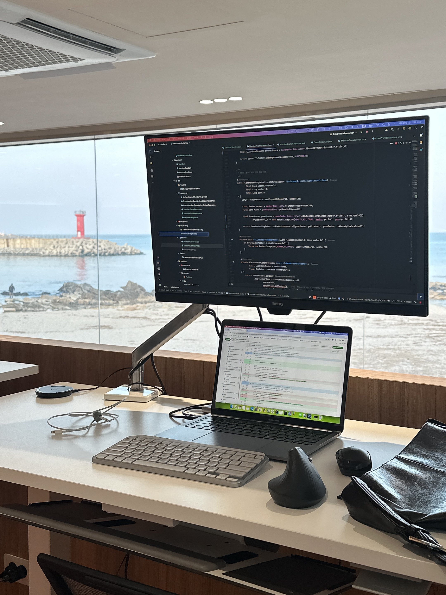
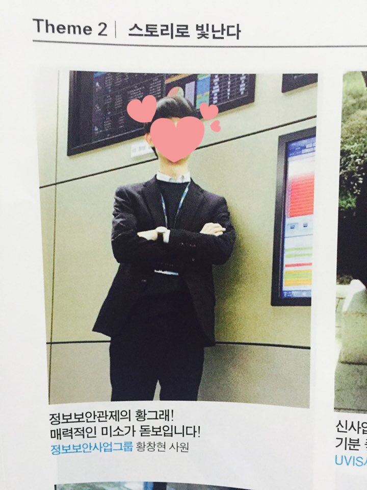
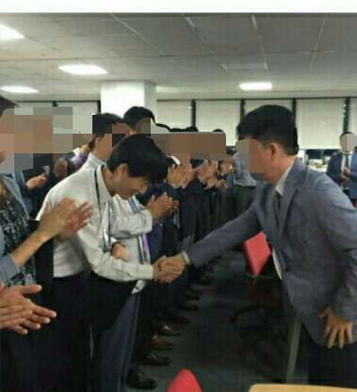
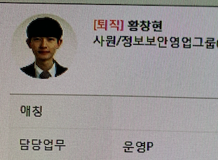
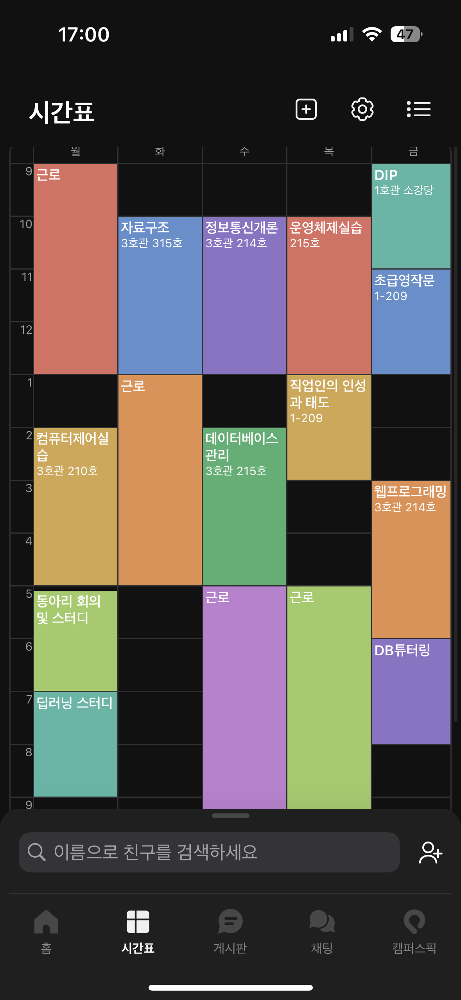
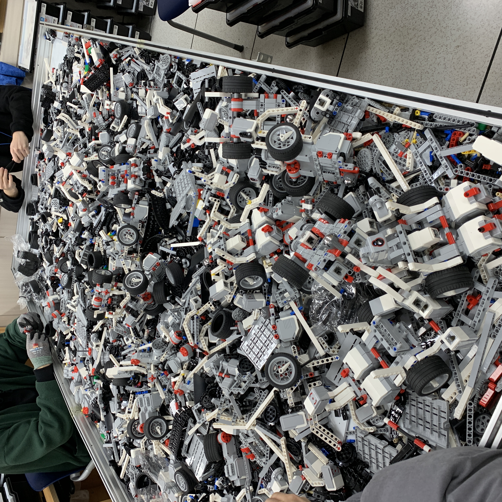
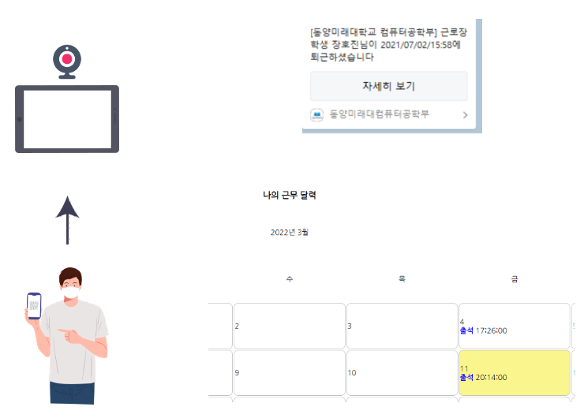
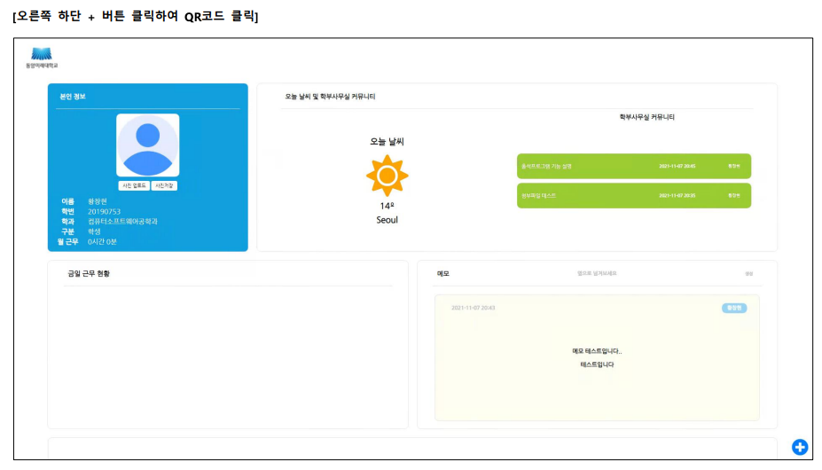
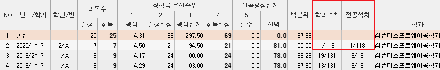
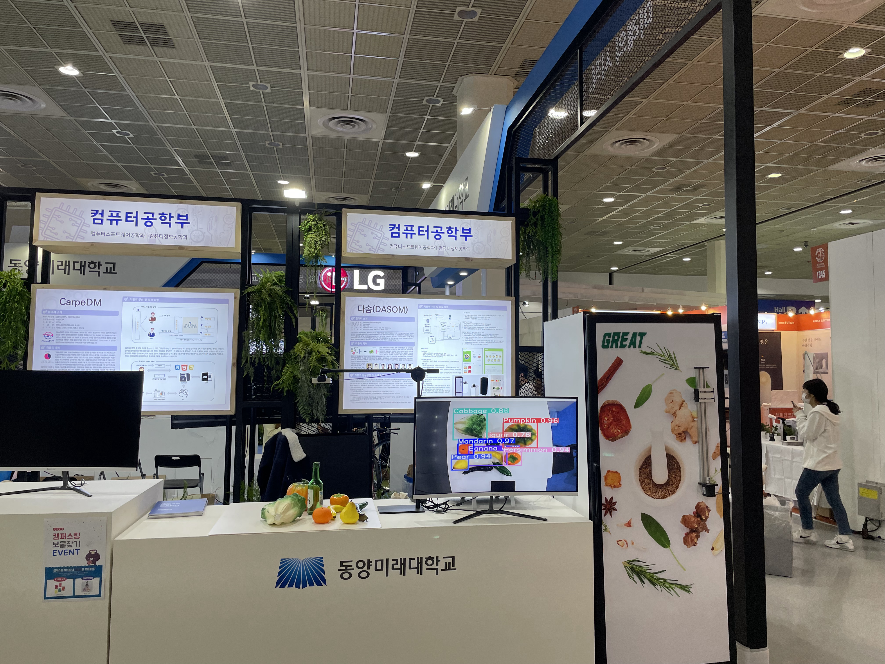

만 나이 개정법을 시행하기 전 나이로 **29살**이 되었다. 

나이도 **30살**이 되기 직전이고, 개발자로 취업하기 전 이력서와 자기소개서를 작성해보니 점점 예전의 기억들이 흐릿해지는 것 같았다. 그래서 개발자가 되기 전 내가 어떻게 살아왔는지 10년간의 회고를 내 인생의 중요했던 순간들을 위주로 기록해보려고 한다.

> *힐링 할 겸 맹그로브 고성으로 공부하러 왔는데 감수성이 풍부해져 더 잘 써질 것만 같다.*

## 고등학생 시절
집안 사정으로 인해 인문계에서 특성화고로 전학 간 이후 가고싶어했던 대학의 꿈을 접고 취업의 길에 접어들게 되었다. 대학을 가기에 현실이 녹록치 않았고, 순순히 현실을 받아들이고 가족을 위해 취업을 위한 공부를 하려고 노력했던 것 같다.

### 기능 경기 대회
특성화고등학교에서는 보통 기능경기대회라해서 특정 과목에 대한 기술을 공부하여 대회에 나가곤 했는데, 입상하면 대기업에 합격할 때 이점이 크다 들었다. 그래서 대기업 취업을 위해 기능 경기 대회에 나가기로 마음먹고 관련된 공부를 시작했었다. 전학을 가게되어 남들보다 늦은 2학년 때부터 시작하긴 했지만 리눅스를 다루거나, 네트워크를 구축하는 기술들이 재밌어서 꽤 즐겁게했던 기억이 남아있다. 물론 2학년 내내 수업이 끝나고 저녁 9시까지 공부하다 가는게 힘들긴 했지만 나름 재밌는 추억이었다. 

> 그 시절 거의 매일 먹었던 중식집 볶음밥은 **진짜루** 맛있었다,,  
> 중식집 이름이 **진자루**였나? 

그치만 드라마처럼 짧은 시간 내에 수상하는 것은 역시나 어려웠다. 짧은 시간도 문제였지만 지금 생각해보면 좀 더 적극적이지 못했었고 공부를 효율적으로 하지 못했었던 것 같다.

### 취업 준비
기능경기대회에서 수상하지 못했더라도 열심히 하면 대기업에 취업할 수 있을거라는 생각에 교내에서 회장, 멘토링 수업, 교환 학생과 같은 대외 활동, 학과 1등 하기 등 할 수 있는 모든 것을 다 하려고 노력했다. 그렇게 3학년 2학기가 되었고 국내 대기업들 중 가장 유명한 그룹의 한 계열사에 먼저 지원 했다.

> *사실 지금 같았으면, 다른 곳을 먼저 지원해보고 들어가기 힘든 곳을 제일 늦게 지원했을 것 같은데 무슨 깡이었는지 모르겠다.*

**지원서 작성 ➡️ 인적성검사 ➡️ 면접 ➡️ 신체검사 ➡️ 합격**

인적성 검사 시험은 한 두달 정도 준비해서 쉬울거라 생각했었는데 생각보다 시간이 부족했고 기대보다는 못 풀었다고 생각했었다. 걱정만했던거와 달리 인적성검사에 합격하여 마지막 관문인 면접까지 보게 되었다. 면접이 아직도 기억에 남는데 너무 긴장한 나머지 면접 장소 메일을 잘못 읽고 본사에 찾아가서 면접장이 어디냐고 물어봤었는데,, 다행히 한 시간 전 도착을 기준으로 출발해서 시간내로 원래 장소에 도착할 수 있었다. 면접 시간도 다른 분들보다 짧아서 떨어졌다는 시그널인가 싶었다.

### 대기업 합격
그렇게 긴 시간이지나 합격 발표가 났고 보자마자 아버지한테 전화드려 합격했다고 신나게 얘기했던 기억이 있다. 그때는 회사에 합격해서 행복한 것보다 집안에 보탬이 되어 부담을 덜 수 있다는 생각에 안도감이 컸던 것 같다. 웃음이 많이 사라지셨던 부모님의 웃음이 점차 보이기 시작했던 시기였다.

## 고졸 황그래 사원

내가 딱 회사에 입사했을 때 미생이라는 드라마가 유행했었다. 해당 드라마는 고졸인 장그래 역할을 맡은 인물이 대기업에 인턴으로 근무하며 인턴 기간동안 다른 좋은 스펙의 인턴들과 경쟁을 하며 성장해나가는 것을 그린 드라마다. 부서 분들이 미생을 감명깊게 보셨는지 나에게 **황그래**라는 별명을 부여해주셨는데, 고등학교 졸업 후 바로 취업해서 고군분투하는 나와 되게 비슷한 느낌이어서 어울리고 나름 좋았던 별명이었다.

> *그 별명으로 유명해져 사내 잡지에 올라가기도 했었다.*

### 회사 생활 시작
회사는 정말 현실이었다. 고등학교를 갓 졸업한 나는 할 수 있는게 거의 없었다. 내가 있던 부서는 정보보안과 관련된 부서로 고객사의 UTM 장비를 관리하고, 보안 관제를 하는 것이었는데 고등학교 수준에서 내가 배웠던 기술들과는 많이 달랐었다. 

> *아! 원래 배치받을 부서가 있었는데 조금 더 IT쪽, 기술적으로 성장할 수 있는 곳에 가고 싶어 부서 배치 면접에서 강하게 나를 PR해서 부서를 옮겨달라고 했다. 그 부서가 정보보안 관련된 부서였다*
>

내가 이 부서에서 할 수 있는 일이 별로 없다고 생각이 든 순간, 우선 부서 내에서 살아 남기 위해 어떤식으로 해야할지 고민해보았다.

**1. 무조건 남들보다 늦게 퇴근한다.**

되게 무식한 방법이라고 생각이 들 수 있지만 효과가 좋았다. 퇴근은 18시였지만 대리님, 과장님, 차장님은 21시를 넘어서 퇴근하시는 경우가 많았는데 남아서 저녁 식사도 같이하면서 회사 얘기도 듣고, 부서 내 문서들을 많이 읽으려고 노력했었다. 또 남는 시간에는 꾸준하게 네트워크와 리눅스 공부를 하려고 노력했었다. 

**2. 선배들이 어떤 일을 하는지 꾸준하게 관찰하고 기록하고 물어본다.**

아무래도 선배들이 하시는 업무가 곧 내 업무이기도 했던 우리 부서 특성 상, 남들을 따라하면 반이라도 갈 수 있었다. 선배들이 하신 업무 자료를 계속 꾸준하게 보려고 노력했고, 모르는 것은 진짜 하나부터 열까지 다 물어봤었다. 사실 그때는 **'이런 것 까지 물어봐?'** 라고 할 정도로 너무 많이, 너무 다양하게 물어보긴했지만 결과적으로는 그런 꾸준함과 노력으로 업무 능력을 키울 수 있었다. 앞으로 회사에 들어가면 좋은 질문을 하기 위해 노력할 것이다.

**3. 예스맨이 되자**

관제 업무도 있어서 24시간으로 근무가 돌아가다보니 아침 회의 때, 인수인계 시간이 필수적이었는데 하던 업무를 넘겨 받아야하는 경우가 많았다. 까다로운 것 부터 귀찮고 어려운 업무까지 다양하게 있는데, 이러한 업무들을 최대한 내가 다 가져가려고 했다.

> **[아침 회의 시간]**  
> **선배**: 이거 처리해주실 분 계실까요?  
> **나**: 저요! 제가 하겠습니다!

모든 업무에 대해 예스를 한 셈이다. 업무 처리가 힘들었던 경우도 많았는데 이때의 경험들이 많이 쌓여 정말 많이 성장했었던 것 같다. 회의 뿐만 아니라 부서 분들이 하기 싫어하는 일을 내가 책임지고 하려고 했던 경우가 많았다.  아! 그리고 황그래로 불릴 때 "그래"의 의미는 예스맨이기도 했었다. 내가 너무 다 좋다, 다 하겠다라고 했었나 싶다.

위 내용 말고도 꽤나 많았는데 내용이 길어질 것 같아 중요한 것만 적었다. 이렇게 꾸준하게 노력하니 부서 분들이 나를 인정해주기 시작하셨고 고과 평가에서 좋은 평가를 받을 수 있었다. 그리고 감사하게도 회사에서 상을 받을 수 있었다. 달마다 사업부 별로 열심히 노력하는 직원에게 주는 상이었는데 열심히 노력하는 것을 알아주는 것에 대해 너무 감사했고, 인정받은 것 같아 뿌듯했다.

> 상 받는 것이 어색해서 그런지, 사진에서도 어색함이 느껴지는 것 같다,,

### 군 휴직, 그리고 복직
그렇게 열심히 일을 하다가 나라의 부름을 받아, 군 복무를 하고 다시 바로 회사로 돌아가게 되었다. 복직 후에는 부서 내 새로오신 분들이 많으셨었고 다들 똑똑하시고 잘하셔서 배울점이 많았었다. 복직하고도 휴직 이전과의 업무가 비슷하여 금방 적응해서 일을 하고 있었고 비슷한 일이 연속되었다. 

고등학생 때는 목표가 대기업 취직이었는데 막상 입사 후 정신없이 보내다가 이 시점에서 목표없이 비슷한 일을 계속하고 있다보니 좀 힘들었던 것 같다. 그리고 일은 적응되고 많은 것을 할 줄 알았지만 기초가 항상 부족하다고 느꼈었다. 이러한 복합적인 생각이 들면서 생각해보니 '내 원래 목표는 대기업이 아니라 대학이었지'라는 생각이 들었고 깊은 고심에 빠졌다.

### 개발자가 되고 싶다
대학을 가는 이유가 비단, 일이 지루해서는 아니었다. 어려서부터 나는 컴퓨터에 관심이 많았었다. 예를 들면, 초등학교 6학년 때 게임을 되게 좋아했는데 프리 메이플이라해서 메이플 사설 서버를 따로 열어 할 수 있는 방법이 있었다. 그 어린 나이에 클라이어트 서버를 어디서 구해서 영상을 따라하며 MySQL을 설치하고 만지작 만지작하다가 결국 서버를 오픈했었고, 그 서버를 친구와 단둘이 했던 기억이 아직도 남아있다.

고등학생 때는 웹 사이트를 만들어보고싶어 영상을 따라하며, 가비아 호스팅을 해보았는데 생각보다 어려워서 실패했었고, 회사를 다니면서는 회사 선배와 게임을 만들어보고싶어 유니티를 공부해 본적도 있었으며 회사 내 효율적이게 돌아가지 못하는 프로세스를 자동화 해보려고 노력해본 경험도 있다. 이렇게 나는 일상 생활에서 개발과 관련된 경험을 많이 해보다보니 자연스럽게 개발자가 되고싶다라는 생각이 강했던 것 같다.

### 퇴사
개발자가 되고 싶다는 마음이 점점 커져서 퇴사를 하고 싶었지만 내가 퇴사하면 가족의 부담이 늘어나는 것이 아닐까 쉽게 퇴사를 확정 짓지는 못했다. 그러던 중 부모님께서 가도 좋다고 가서 열심히 해보라고 말씀해주신 덕에 조금의 부담은 내려놓고 퇴사를 결정지을 수 있었다. 회사에 퇴사한다고 얘기했을 때 많은 분들이 아쉬워해주셨는데 좋아해주시고 아껴주셨던 부서분들에게 정말 감사하다.

> 퇴사 후 동기가 가지말라고 나에게 보내준 사진이다.  
> 이 사진을 보내주었던 동기는 아직도 회사를 다니고 있는데 벌써 9년차인 멋진 직장인이다.

## 새로운 시작, 대학으로
적지 않은 **나이 24살**, 대학에 입학했다. 

나보다 4살 어린 친구들과 같이 시작하는 것이라는 생각이 들면서 공부를 열심히 해야겠다고 마음먹고 교내에서 하는 건 무엇이든 다 하려고 했다. 

> 위 사진은 1학년 2학기 시간표인데, 24학점을 들으면서 동아리 활동, 스터디, 튜터링, 근로장학생까지 했었다. 

### 다양한 경험

#### 컴퓨터공학부 근로장학생
우선 대학 입학시 가장 걱정되었던 것이 금전적인 부분이었다. 회사를 다니다 퇴직하면서 가족의 부담은 늘어났었고 온전히 공부만 할 수 없는 상태였었다. 그래서 아르바이트를 찾던 중 컴퓨터공학부 근로장학생을 뽑는 것을 보았는데 학과 교수님들과 친해질 수 있는 기회와 학부 내 전달사항을 빠르게 받아볼 수 있고 좋은 경험을 할 수 있을 것 같아서 지원해서 합격했었다.

컴퓨터공학부 근로장학생으로 근무하며 주로 아래와 같은 일들을 했다.

- 학과 수업 PC 개발 환경 구축
- PC 점검 및 수리
- 실습실 문 열고 닫기, 청소

위는 요약해서 적어보이지만, 방학 때도 주 5일 8시간씩 출근하여 모든 강의실에 있는 PC를 포멧하고 개발 환경을 세팅하는 등 실습실에서 일어나는 모든 일을 했었다.

> 위 사진은 레고로 내가 원하는 형태를 만들고 C언어로 코딩을하여 센서를 통해 움직이는 로봇을 만드는 수업이었다.
> 한 학기가 종료되면 학생들이 만든 레고들을 모두 분해하여, 각 키트의 부품 종류에 맞게 다시 넣어둬야하는데 이게 진짜 오래걸려서 힘들었었다.

가장 기억에 남는 것은 근로장학생으로 근무하며 출석 프로그램을 개발한 것이었다.
근로장학생은 매월 말일 근무일지를 작성해야하는데 근로장학생이 워낙 많기도하고 시간을 짧게하다보니 매주마다 시간표가 동일하지 않은 경우가 많아 까먹는 경우가 많았다. 이때 자기가 언제 출근했는지 항상 기록해두었어야했는데 이게 너무 불편하기도 했었고 여러명이 근무하다보니 인수인계도 잘 안되어 업무 누락되는 경우도 허다했다. 이런 불편한 것을 어떻게 개선할 수 있을까 고민해보다가 출석 프로그램을 만들어 웹사이트와 연동시키면 해결할 수 있을 것이라 생각했었고 **혼자 개발하여 학부 근로장학생들이 사용하며 근무일지 누락, 업무 누락 등 다양한 것을 개선**시킬 수 있었다.

> 위 사진은 출석 프로그램 시나리오인데 아래와 같다.  
> 1. 만들어진 사이트에서 회원가입을 한다. 회원가입을 하면 학번이 담긴 QR코드를 부여받는다.  
> 2. 출근시 부여받은 QR코드를 학부 사무실에 위치한 캠을 통해 출석한다.  
> 3. 출석 또는 퇴근시 사이트 근무 달력에 출석이 찍히고, 카카오톡으로 연동된 학생들은 카카오톡으로 출석 또는 퇴근 메세지를 받을 수 있다.  
> 4. 퇴근시 사이트에 인수인계를 남기고 다음 출근하는 학생들이 특이사항이 없었는지 체크한다.

> 백엔드를 더 좋아했지만 프론트엔드에도 관심이 많아 사이트를 예쁘게 만드려고 노력했는데,, 확실히 디자이너가 필요한 이유를 알겠다.

#### 과 1등을 하다

대학을 다니며 또 한가지의 목표가 있었는데 과 1등으로 장학금 받기였다. 물론 1등을 하면 기분 좋은 것도 있겠지만 학비 면제 이유가 가장 큰 이유였다. 특별한 공부법은 없었던 것 같았고 수업할 때마다 앞쪽에 앉아서교수님께서 하시는 말씀을 모두 머릿 속에 담으려고 노력했던 것 같다. 한 번 1등을 해보니 과 수석으로 졸업해보고 싶은 목표가 생겼고, 이후에도 1등을 몇 번 했었으나 아쉽게도 차석으로 졸업하게 되었다.

#### 전공 튜터링

1학년 때 근로 장학생을 하며 선배분들에게 공부도 많이 배웠었는데 아는 내용을 누군가에게 가르쳐주는 모습이 너무 멋있어보이고 좋은 일이라고 생각했었다. 2학년까지는 아직 많이 부족하다고 생각이 들어 누군가를 가르친다는 것에 겁을 먹었었는데, 3학년 때는 이제 개발에 대한 것을 나도 후배들에게 가르쳐줄 수 있겠다 싶어서 학과에서 진행하는 전공 튜터링을 신청했었다. 그때 내가 가르쳤던 과목은 `웹프로젝트실습` 이라는 과목인데 JSP를 이용하여 한 학기동안 웹 사이트를 만들어서 발표하는 프로젝트 수업이었다. 약 10주동안 주마다 2시간 이상씩 PPT를 만들어 수업하는 형식으로 JSP 기본부터 학교에서는 배우지 않는 API 활용 방법이나, Ajax를 이용한 비동기 통신 등 다른 학생들과의 차별점을 만들어주려고 노력했었다. 그 결과 5명의 튜티 모두 `A+` 성적을 받을 수 있게되었고, 전공튜터링 설문지에서 튜티들이 '내 인생의 멘토'라고 언급할 정도로 열심히 챙겨주었던 것 같다. 

내가 알고있는 지식들을 누군가에게 공유하고, 그 지식을 통해 좋은 영향을 미칠 수 있다는 것은 정말 보람찬 일인 것 같다. 

> *나중에 기회가 된다면, 배우고 싶은데 배우지 못하는 아이들 또는 학생들에게 무료로 코딩을 가르치는 봉사도 해보고싶다.*

#### 전공 동아리 회장, 그리고 한국전자전 졸업 작품 전시

#### 컴퓨터공학부 조교

### 졸업 후 취업준비

## 프로그래머스 백엔드 데브코스

## 현재의 나

