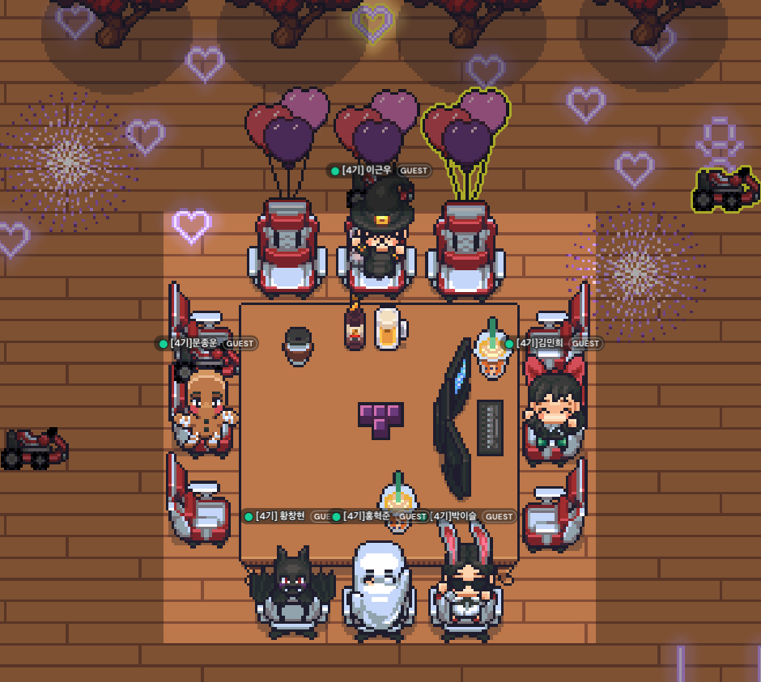

**PRE팀 기간** : `23/06/01 ~ 23/06/15` 　　　　

### 백엔드 데브코스 시작

그렇게 기다리고 기다렸던 데브코스가 시작되었습니다. 교육 받기를 기다리며 **가장 걱정했었던 것**은 **데브코스에 온 친구들이 너무 잘하지 않을까?** 라는 걱정이었습니다. 근데 **정말 잘하더라구요**. 이 내용에 대해서는 뒷쪽에서 얘기하도록 하겠습니다. 　　　　

#### 1️⃣ Week

OT를 진행하고 6명이 한 팀이되어 아이스브레이킹을 진행했습니다! 아무래도 처음이라서 그런지 모두 어색어색했던 것 같아요. 그렇게 아이스브레이킹이 끝나고 공부할 수 있는 시간을 갖게됩니다. 제가 말씀드리는 이 공부할 수 있는 시간은 `코어타임`이라고 부르며 13시 ~ 19시동안 동료들이 같이 공부한다는 느낌을 받을 수 있도록 게더타운을 활용해 캠을 키고 공부하는 시간이었습니다. 학습의 경우 녹화된 강의를 수강하고 나머지 시간에는 자유롭게 복습하고, 하고싶은 공부를 하면 되더라구요.

가장 놀랐던 점은 교육 커리큘럼외에 **많은 것을 할 수 있도록 시키는 것**이었습니다. 노션은 보여드릴 수 없지만 굉장히 많은 페이지가 있더라구요,,

    1. 팀 스크럼 회의
    2. 스터디 독려
    3. 월마다 실시간 세션 2번 이상
    4. 멘토, 서브멘토와 팀 미팅 주 1회
    5. 코드리뷰 과제
    6. 디자인 패턴 발표

사실 이것 말고도 더 많다고 생각하는데 다 적기가 힘들어서,, 그리고 가장 좋은 점은 매니저님의 열정입니다. 교육생들에 대해 진심으로 생각해주시고 성장시키려고 많이 노력해주시는 모습이 짧은 2주기간동안 잘보였던 것 같아요. 　　　　

#### 2️⃣ Week

첫 주는 오리엔테이션과 아이스브레이킹하고 적응하느라 많은 것을 하진 못했던 것 같아요. 2주차부터는 팀원분들과 소통도 많이했었고 강의도 열심히 들었던 것 같아요! 2주차에는 자바 심화 Optional, Interface, Stream 을 배웠습니다! 그리고 2Week ~ 3Week 동안 과제가 주어지는데 생각보다 어려웠던 것 같아요. 사실 저는 자바를 기초만 알고 제대로 할 줄은 모르는 상태였거든요! 그렇게 열심히 프로그램을 만들어서 PR을 올렸습니다! 　　　　

#### 3️⃣ Week

3Week은 DB DML, DDL 그리고 Index와 관련된 것을 배웠습니다! 정보처리기사를 준비하며 많이 공부했었기 때문에 난이도가 높진 않았던 것 같아요! 그것보다 프로그램 만든거 PR올린거에 수 많은 리뷰가 달려서,, 리팩토링하는데 오랜시간을 투자했던 것 같아요. 객체지향과 자바의 컨벤션에 대한 개념이 없었어서 네이밍부터 컨벤션, 책임 분리 등 굉장히 많은 것을 고치면서 짧은 기간내에 성장한 느낌이 들었어요! 　　　　

### 🌈 가장 좋았던점

#### 1\. **팀원분들의 실력이 굉장히 좋아서 배울 것이 많았습니다.**

```
 - 저의 경우 팀원분들에 비해 좀 실력이 떨어진다고 생각이 많이 들었어요.
 - 스프링 부트로 프로젝트를 좀 하고 오신 분들도 많았었습니다.
 - 모르는 것을 시도 때도 없이 질문했지만 팀원분들께서 자세하게 알려주시려고 많이 노력해주셨습니다.
```

#### 2\. **동료 성장이 초점입니다.**

```
 - 앞에서도 얘기했지만 동료들에게 물어보고 얻을 수 있는 것이 굉장히 많습니다.
 - 팀원 뿐만이 아니라 스터디를 하면서, 또는 발표하는 것에 대해 질문을 하면서 굉장히 많은 것을 얻어갈 수 있습니다.
```

#### 3\. **멘토님과 서브멘토님 두분이서 6명을 관리합니다.**

```
 - 멘토님과 서브멘토님께서 직접 코드리뷰를 해주시고 최소 2번 이상 해주십니다.
 - 팀 미팅, 개인 미팅 뿐만 아니라 요청드릴 때마다 모든 질문에 진심을 다해서 대답해주세요!
```

#### 4\. **세션 특강**

```
 - 업계에서 유명하신 분들을 초청해주셔서 세션 특강을 진행합니다.
 - 짧은 시간이어도 생각보다 되게 배울게 많다고 느껴지고 좀 더 불타오르는 것 같아요!
```

#### 5\. **스펜서 매니저님**

```
 - 다른 교육과 가장 차별화된 점이라고 생각하는데 매니저님께서 모든 교육생이 성장하는데 진심이십니다.
 - 면접에서 본인이 합격한 이유에 대해서 자세하게 알고 계시며 모든 것을 기록해두세요!
 - 찾아보면 매니저님께서 직접 쓰신 글을 읽어볼 수 있는데 정말 생각이 깊으시고 진심이라는 것을 느낄 수 있습니다!
```


사실 이것 말고도 좋은 점이 너무 많아서 다 담기가 어려운 것 같아요. 가장 좋았던 점에서 하나만 뽑자면 **동료 성장**인 것 같아요. 서로 모르는 것을 물어보고 알아가며 소통과 성장을 배울 수 있는 기회? 기술적으로 잘하는 것도 중요하지만 무엇보다 소통이 가장 중요하다고 생각합니다! 기술뿐만 아니라 커뮤니케이션을 배울 수 있는 곳이기도 해서 너무 만족하고 있습니다! 그리고 무엇보다 우리 PRE팀의 팀원들 제가 제일 고맙고,, 아끼는 나의 PRE팀 팀원들 항상 고맙습니다!! 👍👍👍