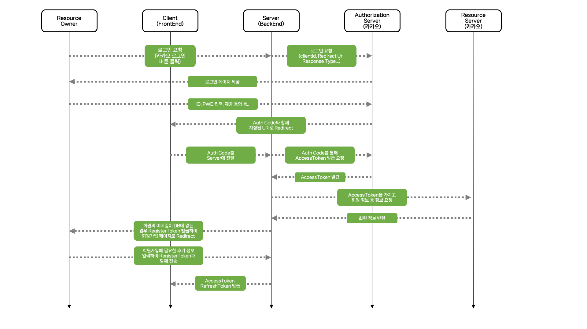

## 고민 배경

제가 했던 프로젝트에서는 소셜 로그인만 가능하게 두어서 소셜 로그인으로만 회원가입이 가능합니다.

일반 회원가입 로직과는 다르게 OAuth로 최초 로그인시 백엔드 서버에 회원 정보가 없을 때 **회원 가입** 을 하게 됩니다.

OAuth 제공자인 카카오에서 주는 `oauthId`, `email`, `nickname`, `profileImageUrl` 로 간편하게 회원가입할 수 있다면 로그인 요청시 바로 회원가입을 진행하면 되지만, 현재 진행하고 있는 프로젝트에서는 회원에 대한 추가적인 정보(`position`, `address`) 를 받아야만 하는 상태입니다.

## 생각해 본 해결 방법
1. 우선 OAuth 제공자에서 주는 정보로만 회원가입을 진행하고 정보 미입력 상태를 추가한다. 그리고 추가 입력이 필요한 `position`과 `address`를 이용하는 서비스에 접근할 때 정보 입력 상태를 확인하고 미입력이면 추가 정보를 입력받고 입력 상태면 서비스에 접근을 허용시킨다.

2. 클라이언트는 소셜 최초 로그인 후 추가 입력을 받는 회원가입 페이지를 접근할 때 짧은 유효기간을 갖는 RegisterToken을 발급받는다.

우선 떠오르는 방법은 위 두 가지였는데 첫번째 방법이 흔하게 사용되는 것 같았습니다. 

하지만, 추가 입력이 필요한 `position`과 `address`를 이용하는 서비스에 접근할 때 회원 테이블의 정보 상태 컬럼에서 요청한 회원이 정보가 미입력 상태인지 확인해보는 작업이 필요한데 저는 관련된 기능을 요청할 때마다 DB에 접근하여 I/O 작업을 해야한다는 점이 성능상 좋지 못하다고 생각했습니다. CustomAnnotation과 ArgumentResolver로 관련 기능을 구현할 수 있을 것 같지만 성능을 고려하여 두번째 방법을 고려해보기 시작했습니다.

두번째 해결 방법은 소셜 최초 로그인 후 추가 입력을 받는 회원가입 페이지를 접근할텐데 이때 백엔드 서버에서 짧은 유효기간을 갖는 RegisterToken을 발급받는 것 입니다. 첫번째 방법과는 달리 회원가입 API에서만 검증하면 되기도하며 따로 DB에 접근하지 않고 RegisterToken만 검증하면 된다고 생각해서 더 효율적이라고 생각했습니다.

## 해결
### **RegisterToken 구현 흐름**

1. 최초로 소셜 로그인을 완료하면 OAuth 제공자를 통해 백엔드 서버에서 `oauthId`, `email`, `nickname`, `profileImageUrl`를 받는다.

2. `oauthId`로 회원 테이블에 사용자가 존재하는지 확인한다.<br>
    (위 그림에서는 이메일로 확인한다고 나와있는데 실제로 OAuth를 이용할 때는 OAuth에서 제공하는 ID로 사용자를 구분해야 함.)
    

3. 회원 테이블에 사용자가 존재하지 않는 경우 RegisterToken이라는 JWT Token을 만든다.
  - 이때 RegisterToken 즉 JWT 토큰에 들어가는 Subject는 OAuth 제공자와 OAuthId 값을 합쳐서 만들며 만료 시간은 10분으로 한다.
    ``` java
    final AuthTokens registerToken = jwtProvider.createRegisterToken(oauthProviderName + oauthMember.getOauthId());
    ```
  - OAuth 제공자와 OAuthId를 합치는 이유는 카카오와 네이버의 OAuthId가 동일할 수 있는 것 처럼 OAuth 제공자들의 id의 겹치는 현상을 방지하기 위해
4. 만든 토큰을 클라이언트에게 보내주면서 OAuth를 통해 받은 `oauthId`, `email`, `nickname`, `profileImageUrl`, `oauthProvider`를 같이 넘겨준다.
   - 같이 넘겨주는 이유는 회원가입시 필요한 정보이기 때문에
5. 클라이언트에서는 회원에게 추가 정보를 입력 받고 회원가입 API 요청을 할 때 헤더에 RegisterToken을 추가하여 보낸다.
6. 백엔드 서버에서는 해당 요청을 받아 RegisterToken이 정상적인 토큰인지 검증한다.
7. 정상적인 토큰이라면 Controller에서 사용자가 회원가입시 보낸 oauthId와 oauthProvider를 조합하여 토큰에서 나온 subject값이 일치하는지 확인한다.
   ``` java
    @PostMapping
    public ResponseEntity<AuthenticatedMemberResponse> createMember(
            @SignUp final String oauthSubject,
            @Valid @RequestBody final MemberCreateRequest memberCreateRequest,
            final HttpServletResponse httpServletResponse
    ) {
        final String oauthProviderName = memberCreateRequest.getOauthProvider().name();
        final String requestOauthSubject = oauthProviderName + memberCreateRequest.getOauthId();

        if (!oauthSubject.equals(requestOauthSubject)) {
            throw new MemberException(MEMBER_SIGNUP_OAUTH_SUBJECT_INVALID, requestOauthSubject);
        }

        ... 생략
    }
   ```
   - 위와 같은 검증을 다시 하는 이유는 혹시나 누가 토큰만 탈취했을 때 회원가입 API를 요청을 보내면 토큰만 있어도 회원가입을 할 수 있기 때문(안전 장치)
8. 정상적으로 회원가입을 진행한다.

## 마치며
위 로직은 흔하지 않은 방식이겠지만 로그인 과정에서의 효율성과 상황 등 여러가지에 대해 직접 생각해보며 제가 생각한 것을 그대로 구현해내면서 많이 배웠던 것 같습니다.
아! 그리고 이 글을 작성할 때 이미 두번째 방법으로 구현한 상태인데 첫번째 방법에 대해 글을 작성하다보니 첫번째 방법으로 구현해도 좋을 것 같다고 생각이 들었습니다.
처음에는 매 요청시마다 무조건 DB에 접근하여 확인해보아야할 것 같다고 생각했었는데 우선 회원가입시키고 로그인시 토큰을 만들 때 회원 정보 입력 상태를 토큰에 같이 넣고 그것을 ArgumentResolver로 처리하면 될 것 같네요. 역시,, 개발은 넓은 시각으로 많이 생각해보아야하는 것 같습니다. 그래도 제 생각을 담아내서 개발한다는 것은 참 즐거운 일인 것 같아요! 😆