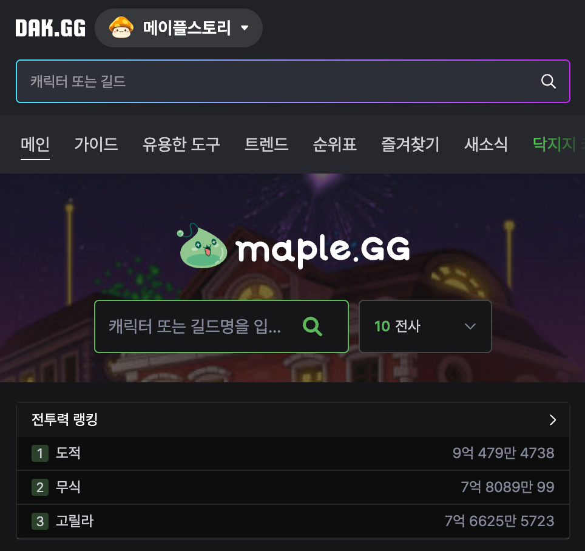
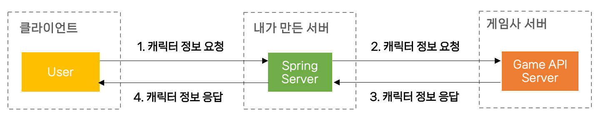
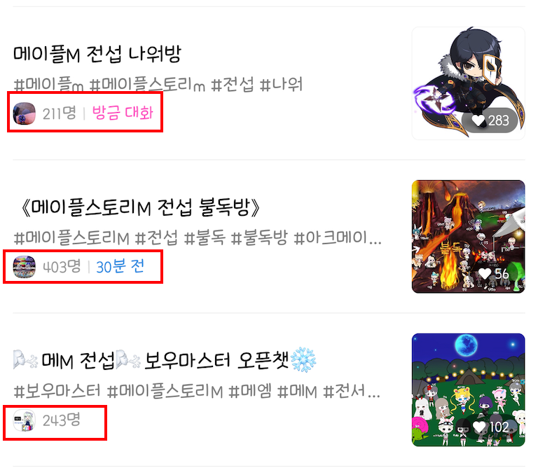

제목을 보고 흥미로운 생각에 클릭해서 들어오신 분들, 우선 사과드립니다. 🙏   
사실 실서비스를 운영하는 것은 아니고, **실서비스를 운영하기 위한 개인 프로젝트를 진행**해보면서 그 기록들을 남겨보면 재밌을 것 같아 그 기록을 시작해보려고 합니다.

## 기획 배경
저는 개발을 시작한 순간부터 언젠간 꼭 내가 만든 프로젝트를 실서비스 해봐야지! 라는 생각이 있었습니다. 그 동안 실 서비스를 위한 아이디어가 없는 것은 아니었지만, 실서비스를 하기에는 많이 부족한 실력이라고 생각했던게 컸었습니다. 물론 지금도 아직 많이 부족한 상태이지만, 오히려 부족한 실력으로 실서비스를 하면서 배워나가는 것이 많을거라 생각이 들었습니다. 

그래서 여러 서비스를 고민해보던 중, 어느 외주 사이트의 이용자분께서 저에게 개발을 부탁했던 메시지가 생각났었습니다. **메이플스토리M이라는 모바일 게임의 API를 이용하여 사용자의 캐릭터 정보를 조회할 수 있는 사이트**를 만들어달라고 말씀하셨었습니다. 안그래도 학부 프로젝트로 리그 오브 레전드라는 게임의 API를 이용하여 전적 검색할 수 있는 사이트를 만들어본 경험이 있어서 만드는 것 자체는 어렵지 않다고 생각했지만, 아무래도 비용을 지불 받고 해야하는 일이다보니 큰 책임감이 생겨 잘 만들어드릴 수 있을까에 대한 의문이 생겼었습니다. 또한 외주를 요청하셨던 분께서 별도의 기획서나 어떤 방식으로 구현해달라는 자세한 요구사항이 없으셨고, 서버가 필요한지 모르셨어서 자세하게 이해시켜드리면서 해당 내용으로는 어려울 것 같다고 안내드린적이 있었습니다.

예전에 외주를 요청받았을 때는 아무 생각이 없었는데, 갑자기 개인 프로젝트로 실 서비스를 위한 서비스를 만드려고 생각해보니 정말 최적이라 생각이 들었습니다.

### **1. PC 게임 전적 조회나 캐릭터 정보 조회 사이트는 많지만, 모바일은 존재하지 않음**  

- 리그 오브 레전드([op.gg](https://op.gg))나 메이플스토리([maple.gg](https://maple.gg/))와 같은 유명한 게임들은 이미 전적 조회 또는 캐릭터 정보 조회 사이트가 많습니다. 하지만 모바일 게임들의 경우 이런 정보를 조회하는 사이트가 아직 없습니다.
  
- 물론, 모바일 게임은 제공하는 API가 일반 PC 게임들보다 현저히 적지만 다른 기능들을 통해 보완할 수 있을 것이라 생각했습니다.

### **2. 사이트 기능이 비교적 단순하여 개인 프로젝트로 구현하기 수월함**

위 그림은 제가 간략하게 그린 시스템 흐름도입니다. 

 1. 클라이언트가 게임 캐릭터 명을 입력하면 입력 값을 제가 만든 스프링 서버로 전송합니다.
 2. 스프링 서버에서는 전송 받은 캐릭터 명을 게임사 서버로 전달합니다.
 3. 게임사 서버에서 캐릭터 명과 인증 키 값이 정상적인지 확인하고 스프링 서버로 응답해줍니다.
 4. 스프링 서버에서는 필요한 응답 값을 모두 모아 하나의 데이터로 클라이언트에게 응답합니다.

우선, 위 기능이 메인 기능이 될텐데 MVP 기능이면서 굉장히 단순합니다. 별도의 데이터베이스가 필요 없을 뿐더러 받은 요청 값들을 하나로 종합하여 사용자에게 전달하면 됩니다. 물론 추후 확장하게 되면 게시판이나, 랭킹과 같은 기능들을 만들어서 데이터베이스나 캐시가 추가될 예정이지만 우선 MVP로만 보면 구현하는데 많은 시간이 소요되지 않을 것 같습니다.

### **3. 많은 커뮤니티가 있어 홍보하기가 쉬워 사용자를 모으기 쉬움**

카카오톡 오픈채팅방만 보더라도 꽤나 많은 사용자들이 이용하고 있고, 해당 게임에 대한 유튜브나 여러 커뮤니티가 존재했습니다. 개발을 하며 오픈채팅방을 통해 홍보하고, 사이트에 대한 피드백과 설문조사를 진행해볼 예정입니다.

### **4. 여러 기능을 확장하기 좋음**
사실 전적 조회나 캐릭터 정보 조회의 기능은 단순하여 그 사이트로만 존재한다면 매력이 없을 수 있습니다. 이런 사이트들은 보통 해당 게임의 커뮤니티로 진화하곤 하는데, 커뮤니티를 만들며 정말 많은 기능들을 추가해볼 수 있을 것 같아서 확장성이 뛰어난 프로젝트라 생각했습니다. 또한 현재는 메이플스토리M에 대해서만 말했지만, 모바일 게임중 API를 지원하는 모든 게임들을 추가할 수 있습니다.

이러한 이유들 때문에, 운영하기 좋은 실 서비스를 만들 수 있겠다는 생각이 들었고 좋은 경험을 할 수 있을 것 같았습니다. 아무래도 취업 준비를 하고 있어 많은 시간을 투자할 수는 없겠지만, 꾸준하게 노력하여 💪💪 실 서비스를 배포하는 그 날까지! 화이팅해보겠습니다.

