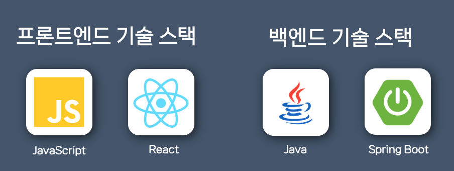
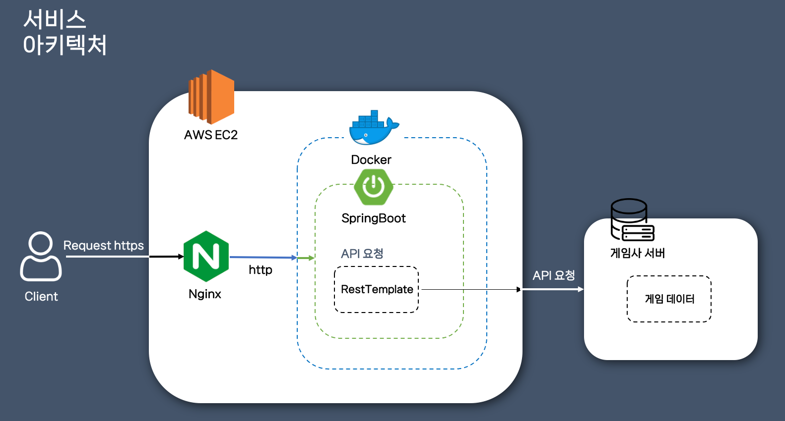

앞 선 글에서는 이 프로젝트의 기획 배경 및 동기에 대해서 설명드렸습니다. 이 글에서는 앞으로 어떤 기능을 만들고, 서비스 명과 설계는 어떤식으로 할지에 대한 것을 적어보고자 합니다.

## 서비스 명
우선 서비스 명은 **간단하면서 눈에 띄어야하고 url 검색이 쉬운 짧은 이름이었으면 좋겠다고 생각**했습니다. 처음엔 메이플스토리M만 생각해서 MM(MapleStoryM)으로 하려했으나, 추후 **다른 모바일 게임의 확장성을 생각**해서 Mobile이라는 단어가 들어갔으면 좋겠다고 생각했습니다.

> **OMG** - Oh Mobile Game

고민하던 중 위와 같이 거의 모든 사람들이 아는 Oh My God이 생각나면서, OMG를 Oh Mobile Game으로 하면 좀 더 쉽게 외우고 머리에 쏙 들어갈 것 같아 OMG로 결정하게 되었습니다.

## 주요 기능
주요 기능은 **MVP 기능과 MVP 이후 업데이트 할 기능**들로 나누어볼 수 있을 것 같습니다. 우선 빠른 시일내에 개발하여 운영해보고 싶었기 때문에 MVP의 기능을 최소화시키고, 추후 확장해나가는 방식으로 개발하기로 결정했습니다.

### MVP 기능
- 메이플스토리M 유저 검색 조회

### MVP 이후 업데이트 예정 기능
- 카트라이더 러쉬플러스, V4, 바람의나라:연 게임의 유저 검색 조회 기능
- 1시간 또는 하루 기준의 게임 캐릭터 조회 랭킹 기능
- 카카오톡을 이용한 로그인 기능
- 게시판 커뮤니티 기능

모바일 게임이어서 제공되는 API의 양이 사실 많지는 않습니다. PC 메이플스토리의 경우 제공되는 API의 개수가 무려 30~40개가 되는데, 메이플스토리M의 경우 5개 밖에 제공되지 않습니다. 적은 API의 개수는 여러 기능을 만드는데 제약을 두지만 오히려 사이트를 단순하게 만든다면, 많은 사용자를 받아볼 수 있을 것 같았습니다.

그리고 아직 초기 단계라 많은 기능이 떠오르진 않지만, 개발하며 필요한 기능들이나 커뮤니티를 통해 설문조사를 받아 추가되었으면 하는 기능들을 모아 가능한 것들을 개발해볼 예정입니다.

## 기술 스택

백엔드 기술 스택으로는 가장 자신있는 자바와 스프링을 선택했습니다. 프론트엔드는 사실 Thymeleaf를 이용하여 구현하려고하였으나, Single Page Application 느낌을 주고 싶어서 상태 관리와 컴포넌트로 재사용성을 높일 수 있는 React를 택했습니다. 사용해본 경험이 있어서 익숙하기도 했구요!

**백엔드에서 API를 요청하는 기술은 RestTemplate을 이용**하고자합니다. 요즘에는 Feign이나 Webclient 등 비동기를 이용하여 Http 통신을 하는 여러가지 기술들이 있지만 스프링 서버에서 캐릭터 정보 요청을 받았을 때, 많은 양의 API를 요청하는 것도 아니기도하고 응답 속도가 빠른 API들이기 때문에 굳이 비동기를 이용하지 않아도 된다고 판단했습니다. 또한 예전 기술들을 겪어보지 않고 비교적 최근 나온 기술들을 사용한다면, 왜 이런 기술들이 나왔는지 이해하기 어려울 것 같다 생각이 들었습니다. 그래서 우선 RestTemplate을 이용해서 실 서비스를 해보고, 일어나는 문제들을 겪어보면서 점차 기술을 진화시키고자 합니다.

## 설계

물론 필요한 것은 대비해놓는 것이 좋지만, 이것 저것 전부 대비해놓는 것은 오히려 오버엔지니어링일 수도 있습니다. 제가 하는 서비스의 경우 우선 잘 될거라는 보장이 없으며 사용자 예측이 불가하기 때문에 단일 서버로 가되, EC2도 제일 낮은 성능의 프리티어를 이용해볼 예정입니다. 우선 기본 아키텍처는 이렇게가고 추후에 모니터링을 위한 서버를 별도로 두어 지켜보면서 서버를 추가하는 방식으로 진행해볼 예정입니다.

아! 그리고 dev 환경과 prod 환경을 분리해보려고 합니다. dev 환경은 제가 집에 가지고 있는 Synology Nas 서버의 Docker를 이용해서 구축할 것이고, prod 환경은 위 그림 그대로 AWS를 이용해볼 예정입니다. 분리하는 이유는 배포 전 QA 작업이 필요할 것 같아서입니다.

이로써 프로젝트의 MVP 기능을 만들기 위한 기본적인 기획은 되었다고 생각합니다. 앞으로의 글에서는 중요하다고 생각되는 부분이나 프로젝트를 하며 겪은 트러블 슈팅에 대해서 적어보도록 하겠습니다.