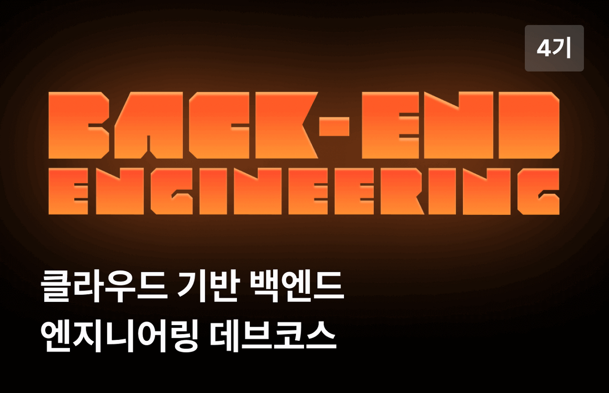
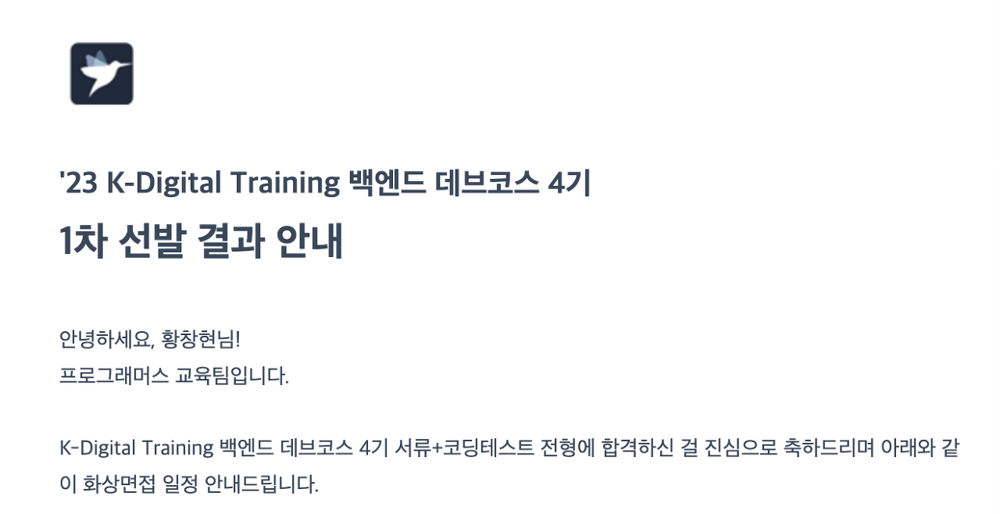
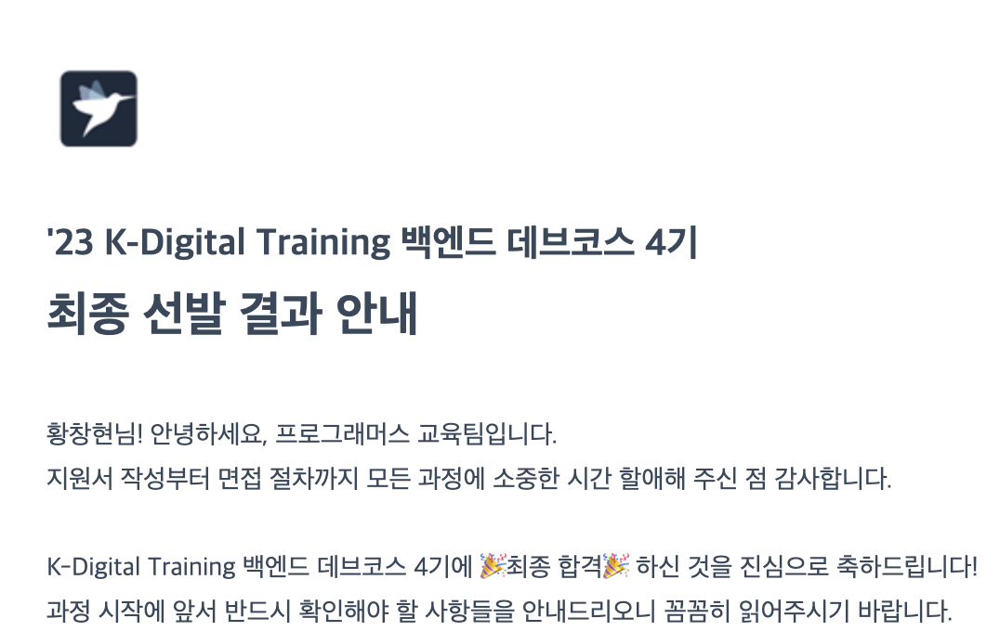

## 🏫 학부 생활

합격 후기를 작성하기 전 곰곰히 생각해보니 학부 얘기를 해야할 것 같아서 꺼내보려고 합니다. 저는 1학년부터 학부 근로장학생으로 일하며 3학년까지 쉴틈없이 학업과 일을 병행하며 지내왔습니다! 주 5일중 3일 정도는 오전 9시부터 오후 10시까지 학교에 있을정도로요! 그렇게 4학년이 되서는 야간으로 학사과정을 했었고 주간에는 컴퓨터공학부 교직원으로 근무했었습니다. 4학년 때는 일찍가서 늦게 집에가는 날이 주 3일이 5일이 되었고 졸업할 때 쯤 많이 지쳐있었던 것 같아요.

위에서 이야기 한 것 처럼 학업과 일을 병행한다는게 쉽지 않았던 것 같아요. 집안 형편상 용돈을 받으며 다닐 수 없었고 그만큼 공부에 집중하지 못하고 일을 많이 했었던 것 같아요. 물론 이것도 핑계라고 하면 핑계라고 할 수 있겠지만요 😅 그래서 항상 공부에 집중을 못하는 것에 대한 아쉬움이 많이 남아있었습니다. 그렇다고 열심히 안한거는 아니에요! 전공동아리에서 회장도 해보고, 전공튜터링을 하며 후배들도 가르쳐보고, 여러 프로젝트를 해보며 한국전자전에 작품을 출시해보기도하고, 상도 받고, 차석으로 졸업해보기도 했답니다!

**왜 이런 이야기를 하냐구요?**  
바로 위에 이야기한 것들이 데브코스에 지원하게되는 계기가 되기도 했습니다. 항상 성적을 받기 위한 공부만을 했을 뿐 개발에 대해 진심으로 공부했다고 말할 수 없었습니다. 그런 생각들이 들면서 한 곳에 집중해서 성장하고 싶다는 생각이 컸던 것 같아요.

## 🎓 졸업 후 취업 준비

그렇게 졸업을 하고 취업을 준비하게 됩니다. 학교에서는 나름 열심히 했다고 생각했던 저는 자만심에 **'나 정도면 어느정도 취업할 수 있겠지!'** 라고 생각했던 것 같아요. 원티드, 프로그래머스, 잡플래닛, 잡코리아 등 다양한 채용 플랫폼에서 70개 정도의 회사에 서류를 제출했고 돌아오는건 서류 탈락 뿐이었습니다. 계속되는 서류 탈락 속에서 두 곳에서 과제, 코딩테스트를 보겠다고 연락이 왔었습니다.

첫번째, 과제를 본 곳의 경우 난이도가 엄청 어렵다고 생각이 들진 않았지만 스스로 풀기는 어려워서 인터넷을 조금 참고해서 전부 다 풀었던 것 같아요. 물론 해당 회사에서도 인터넷을 참고해서 풀라고 안내해주셨었습니다! 몇일을 기다리고 `불합격` 소식을 들을 수 있었습니다. 나름 잘 풀었다고 생각했었는데 지금 생각해보니 많은 것을 고려하지 못했던 것 같았고 언어 컨벤션에 대한 것도 많이 부족했던 것 같아요.

두번째, 코딩테스트를 본 곳이었습니다. 다른 곳과는 다르게 알고리즘 문제가 아닌 DB설계와 클래스다이어그램 같은 것들이 나왔었고 생각치도 못한 것들이 나와서 시간에 쫓겨 다급하게 풀었던 것 같습니다. 다행히 시간내로 전부 다 작성할 수 있었고 제출 후 몇일이 지나고 `합격소식`에 면접을 볼 수 있는 기회가 찾아왔습니다.

제가 데브코스에 지원하게 된 가장 큰 이유가 이 기술면접이었습니다.

기술면접에서 `자바스크립트의 동작원리`, `싱글톤이 무엇인지 설명해주세요` 와 같은 답이 명확하게 나오는 질문들을 준비했었지만 면접관님께서 질의해주신 내용은 명확한 답이 나오는 질문이 아닌 문제를 주고 스스로 생각해서 해결 할 수 있는 그러한 문제들을 내주셨던 것 같아요. 수학적인 지식들도 여쭤보셨었고 SNS DB를 설계해보고 설명해달라고도 하셨었습니다. 모든 문제들에 대해 해결하려고 노력했지만 제 스스로의 부족함을 느끼고 모든 문제에 대해 명확한 답을 할 수 없었습니다. 이때부터 저의 자만심은 굉장히 겸손해지게되었고 스스로 많이 부족한 것을 인정하고 다시 처음부터 제대로 시작해야겠다라고 마음을 먹게되었습니다.

## ✉️ 지원 동기

위에서 말했던 내용들을 정리하여 두가지로 말씀드리자면

1.  학부생활동안 제대로 하지 못했던 개발 공부를 긴 시간동안 집중해서 하고싶었습니다.
2.  취업준비 과정속에서 스스로의 부족함을 인정하니 공부할게 많아졌다고 느껴졌고 개발에 대해서 진심으로 생각하게 되어 지원하게되었습니다.

## 📜 지원 절차

### 지원서 작성

1.  데브코스에 지원하게된 동기
2.  데브코스와 별개로 원래는 어떤 계획을 갖고 있었나요?
3.  왜 개발자가 되고 싶으신가요?
4.  웹 백엔드 분야로 진출하고자 결심한 이유는 무엇인가요?
5.  웹 백엔드 진로를 위해 그동안 노력해온 것이 있나요?
6.  강도 높은 과정입니다. 데브코스에서 어떻게 학습을 이어갈 계획인가요?
7.  현재 또는 과거에 타교육기관/부트캠프 경험이 있다면 기관/과정명/기간을 예시처럼 남겨주세요
8.  Github을 통해 협업한 경험이 있나요? 확인 가능한 PullRequest URL이나 관련 Repository를 남겨주세요.
9.  이전에도 백엔드를 학습 또는 프로젝트를 경험한 적이 있다면 들려주세요. 외부 링크가 존재하는 경우 첨부해주셔도 됩니다.
10.  위의 항목에서 미처 답변하지 못했던 이야기(나의 장단점 등)를 자유롭게 이야기해주세요.

생각보다 작성할 내용들이 굉장히 많았다고 생각했습니다. 여러가지 내용들을 작성하려다보니 글자수 제한보다 초과해서 작성하게되었고 저의 경우 어느정도 초과해서 냈었습니다.

**💁‍♂️ 작성 TIP.**  
분명 본인이 개발자가 되고싶다는 생각이 있었으면 본인의 히스토리가 있을 것이라고 생각됩니다. 없다고 하더라도 본인이 갑자기 개발을 하고싶기 때문에 데브코스를 지원했을 것이라고 생각합니다. 이러한 이유들을 솔직하게 적으시면 좋을 것 같아요. 저는 정말 모든 문항에 대해서 제 진심을 담았다고 생각합니다. 본인을 꾸미려하지 않고 최대한 내 인생을 얘기한다는 느낌으로요.

### 코딩테스트

-   객관식(HTML, CSS, WEB, JAVA, DB, SQL) 36문제
    -   정말 골고루 나왔던 것 같습니다. JAVA도 기초적인 부분이지만 꼼꼼히 할 필요가 있다고 느껴졌습니다.
    -   저의 경우 Javascript위주로 백엔드를 했기 때문에 JAVA 문제만 조금 헷갈리는게 많았고 나머지는 적당히 풀 수 있었던 것 같아요.
-   SQL 코테 2문제
    -   프로그래머스에 있는 SQL문제 다양하게 많이 있으니 어느정도 풀어보셨으면 다 맞을 수 있을 것이라고 생각합니다.
-   Java 코테 2문제
    -   한 문제는 레벨 1정도였고 다른 한 문제는 레벨 2~2.5 사이의 문제였던 것 같습니다.
    -   저의 경우 두번째 문제는 풀지 못했지만 끝까지 포기하지 않고 열심히 코드를 적어가며 끝날때까지 고민했었습니다!

코딩테스트의 난이도가 채용 관련 테스트보다는 훨씬 쉽다고 느껴졌지만 비전공자분들이나 웹에 대한 지식, 자바에 대한 지식이 없을 경우 조금 어렵게 느껴질 수도 있다고 생각이 들었습니다. 그에 맞게 잘 준비하시고 아무리 코테를 잘하시더라도 지원서가 별로이면 떨어질 수도 있다는 글을 어디서 본 것 같아요. 지원서도 꼼꼼히 잘 작성해야될 것 같습니다.

### 면접

면접의 경우 경험과 지원 동기 위주의 대화 형식으로 일대다 형식의 면접이었습니다. 면접관 한 분에 저 포함 지원자 3명에서 보았습니다! 저의 경우 면접을 보기전까지 그동안의 삶을 돌아보면서 저에 대한 내용들을 작성해보며 암기보다는 옛날 생각들을 끌어내려고 노력했던 것 같아요. 질문지를 작성해보고 답도 많이 적어보았지만 실제 면접에서 해당 내용들이 나오지는 않았었습니다. 그래도 미리 작성해보고 많은 저의 경험들을 머릿속에 다시 넣어둘 수 있어서 좋은 방법이었던 것 같습니다.

한가지 더 추가로 말씀드리고 싶은건 기술 질문들도 적지 않았다는 것입니다. 이것도 깊은 CS 지식은 아니지만 어느정도 웹과 자바에 대해 알고 있어야 대답할 수 있는 질문들이었습니다!

## 🎉 합격

그전까지 취업준비를 하며 계속되는 서류 탈락, 면접 탈락으로 인해 자존감도 많이 떨어져서 이 과정도 떨어질 것이라 생각했지만 많은 친구들과 지인분들이 분명 합격할거라고 용기를 주셨습니다. 그 결과! 합격할 수 있게 되었어요. 앞으로 5개월 정도의 긴 시간동안 공부에 집중하며 많은 성장을 이뤄내보려고 합니다. 이 과정을 생각하시는분들도 이 글을 보고 꼭 도움을 얻을 수 있으면 좋겠습니다.

긴 글 읽어주셔서 감사드립니다 😆

궁금하신 사항은 이메일로 연락주시면 답변 가능한 선에서 답변드리도록 하겠습니다.